# AI RAG + Web3 知识资产平台完整方案

> 基于RAG与Web3融合的完整业务与技术方案  
> 融合版综合文档

---

## 目录

0. [项目叙事](#第零部分项目叙事与简述)
1. [项目概述与愿景](#第一部分项目概述与愿景)
2. [业务分析与商业模式](#第二部分业务分析与商业模式)
3. [系统架构设计](#第三部分系统架构设计)
4. [技术实施方案](#第四部分技术实施方案)
5. [业务流程与流程图](#第五部分业务流程与流程图)
6. [实施路线图](#第六部分实施路线图)
7. [关键问题与解决方案](#第七部分关键问题与解决方案)
8. [风险评估与应对](#第八部分风险评估与应对)
9. [预期成果与创新点](#第九部分预期成果与创新点)
10. [附录](#附录)

---

## 第零部分：项目叙事与简述

# 基于NFT+RAG的个人知识资产化方案——人类文明“智慧火种”项目
## 一、项目核心定位与文化叙事
本项目以**NFT+RAG技术**为核心载体，将个人知识、思维与记忆进行数字化处理并上链确权，同时通过检索增强生成（RAG）技术实现知识的交互与复用，结合东西方文化符号打造人类文明的“智慧火种”NFT，定位为**人类个体知识的数字火种库**：
1.  **西方文化符号锚定**：以普罗米修斯盗火的叙事为依托，将NFT定义为“留存人类智慧火种”的数字容器，RAG技术则是实现火种安全取用、传递的技术机制，呼应“为人类造福而留存文明”的精神内核。
2.  **东方文化符号锚定**：以“星星之火，可以燎原”的理念为延伸，每个NFT对应一份个人知识“火种”，通过RAG技术实现单个火种的检索与组合，最终汇聚形成文明的燎原之势，强化“个体知识聚合为集体文明”的价值主张。
3.  **核心价值锚点**：明确“知识是人类的火种，NFT+RAG是火种的永久保存与可控使用方案”，区别于普通数字藏品，突出其“可交互的知识资产”属性。

## 二、NFT+RAG技术实现路径
本项目的核心逻辑为：先完成个人知识的数字化处理，再通过NFT实现确权，最终通过RAG技术实现知识的交互与复用，具体分为四个阶段：
1.  **知识采集：个人大脑知识的数字化复刻**
    通过多模态数据采集与知识结构化处理，复刻个人大脑中的知识网络：
    - 采集维度覆盖文本类（文章、笔记、专利、访谈转录内容）、语义类（思维图谱、决策逻辑、领域框架）、行为类（问题解决案例、创作过程）数据
    - 通过向量数据库（如Chroma、Pinecone）将采集数据转换为向量，建立个人知识索引
2.  **NFT铸造：知识资产的确权与永久化留存**
    通过知识资产上链与元数据强化，实现知识资产的唯一、不可篡改与可追溯：
    - 铸币内容包含知识向量索引的哈希值、原始数据加密哈希、所有者签名
    - 元数据写入普罗米修斯图标、“火种编号”、知识领域标签、RAG交互入口
    - 选用以太坊Layer2（如Arbitrum）或Flow区块链，兼顾低成本与安全性
3.  **RAG交互层：静态知识的激活与可控使用**
    通过检索增强生成技术与权限控制，让静态知识转化为可对话的智慧：
    - 检索逻辑：用户提问后，系统匹配个人知识向量，返回相关知识片段
    - 生成逻辑：大语言模型基于检索结果，生成符合原作者风格的回答
    - 权限逻辑：NFT持有者可设置“公开检索/付费调用/仅个人使用”的权限，收益归创作者或持有者所有
4.  **火种网络：个体知识的生态化扩展**
    支持跨NFT知识索引的联合检索，实现从个体火种到集体文明的价值放大：
    - 搭建跨NFT的知识融合机制，支持多NFT知识索引的联合检索，形成“知识燎原池”
    - 支持领域专家NFT的组合检索，生成跨视角的专业洞见

## 三、落地保障：技术与合规要点
1.  **知识采集合规性**
    - 仅采集用户授权的公开或个人知识，签署数据授权协议，明确知识的所有权与使用权
    - 通过端到端加密保护原始数据，NFT仅存储哈希与索引信息，避免隐私泄露
2.  **RAG性能优化**
    - 采用混合检索模式（关键词+语义向量+知识图谱），适配不同类型的个人知识
    - 通过轻量大语言模型部署边缘节点，降低检索延迟，提升交互体验
3.  **NFT价值强化机制**
    - 设立“火种成长机制”：将每一次RAG调用记录为“火种燃烧次数”，次数同步更新至NFT元数据，强化价值锚点
    - 支持NFT的拆分与组合，多人可联合铸造“领域知识库NFT”，共享收益
4.  **伦理与边界控制**
    - 禁止采集意识、情感等未被科学证实可数字化的内容，规避“数字永生”类误导性宣传
    - 标注知识的时效性，RAG生成结果需注明“基于某时间点的个人知识”，降低信息误导风险

## 四、产品形态与用户旅程
1.  **个人端工具**
    - 知识采集助手：支持一键导入文档、录音转写、思维图谱绘制，自动生成知识向量
    - 火种铸造器：提供可视化界面，支持用户设置NFT元数据（如“盗火者”皮肤选择），实现一键上链
    - 交互界面：采用聊天式交互模式，用户可通过提问获取基于个人知识的RAG回答，支持结果的导出与分享
2.  **公共端平台**
    - 火种库：按知识领域分类展示NFT，用户可浏览知识简介，付费调用RAG接口
    - 燎原广场：展示多NFT联合检索生成的热门洞见，强化集体文明的价值展示


## 第一部分：项目概述与愿景

### 1.1 项目概述

本项目旨在构建一个可扩展的 AI RAG 平台，并在其之上孵化类似 "AI Bloomberg Terminal" 的 Web3 情报与研究产品，使之既 **有用** 又具有高黏性（Useful & Addictive AI）。

平台支持多种文档类型的知识抽取，通过检索增强生成（RAG）为用户提供专业级的信息查询与决策辅助，并支持 NFT / Dapp 等 Web3 扩展能力。

#### 1.1.1 背景与愿景

- AI 模型具备强大的自然语言理解和生成能力，但缺乏对专业、最新和私有数据的直接访问，需要通过 RAG 提升时效性与准确性。
- Web3 生态对信息不对称敏感，迫切需要类似 Bloomberg Terminal 的情报平台，同时希望保留开放性、可组合性与链上激励机制。
- 在信息泛滥且不可信的投资保险领域，我们构建了一个基于Web3激励的可溯源知识引擎。它像GitHub一样管理知识的版本与贡献，像Bloomberg Terminal一样提供专业分析，并通过代币经济让每个参与者都能从创造和验证可信知识中获得回报。

#### 1.1.2 目标与范围

- 提供一个可本地或云端部署的 RAG 平台，支持文件上传、索引构建、问答与计费等完整闭环。
- 在该平台基础上构建 IDEATHON 设想的 AI + Web3 情报终端，并打通 NFT、Dapp、智能合约等模块，实现从查询到上链的全流程。
- 构建一个 "可信、可溯源、结构化的知识图谱"，解决市场供给侧的质量与信任问题。
- 构建一个 "基于技能匹配和动态定价的知识服务交易平台"，解决知识的流动性、变现和需求匹配问题。

### 1.2 研究背景与问题陈述

#### 1.2.1 AI的"线性机制"局限

基于梯度下降与固定架构的模型，在推理和决策上缺乏处理非线性、多目标、动态环境复杂问题的能力（参考赫伯特·西蒙的有限理性论及近期对Transformer"线性思维"的批评）。

#### 1.2.2 "成瘾性"与"有用性"失衡

现有AI（如推荐系统、聊天机器人）旨在最大化用户参与度，可能导致信息茧房、认知窄化（"AI降智"）和依赖。

#### 1.2.3 人机关系错位

当前多为"工具-用户"或"替代-被替代"关系，忽略了人机共生协同的潜力。设计师等专业人士面临"权利转移"与"干扰增多"的挑战。

#### 1.2.4 缺失的文化与语境适应性

AI输出常忽视用户的文化背景、语义习惯与认知风格（"结构会受环境影响"），无法提供个性化"补足"。

#### 1.2.5 边界模糊与安全问题

AI常过度自信，无法自知其局限性（"AI不知道它不知道什么"），在复杂问题中可能产生有信心的错误，缺乏人类式的反思与统筹能力。

#### 1.2.6 传统高端平台（如Bloomberg Terminal）的旧体系

- **中心化生产：** 由少数顶级分析师和记者团队生产内容。
- **单向广播：** 用户被动接受打包好的报告和数据流。
- **高门槛准入：** 年费动辄数万美元，将普通个人投资者和中小企业完全排除在外。
- **信息孤岛：** 不同数据、报告之间缺乏深度、智能的关联。

### 1.3 核心价值主张

**我们不只是给你答案，我们为你匹配能解决问题的人，并确保整个过程像外卖点单一样简单、透明、有保障。我们打破信息的壁垒，让知识普惠并交易可信。旨在为构建下一代有用（Useful）而非成瘾（Addictive）的负责任AI奠定理论与技术基础。**

核心价值包括：

1. **知识资产化**：将知识转化为可交易的数字资产（NFT）
2. **去中心化存储**：使用IPFS确保数据安全和可访问性
3. **智能激励机制**：通过代币和NFT激励知识贡献者
4. **精准检索**：RAG技术提供高质量的智能问答
5. **开放生态**：支持多链、多数据源、API开放

### 1.4 产品愿景与应用场景

#### 1.4.1 AI Bloomberg Terminal / Web3 情报平台

本项目的一大典型应用是面向 Web3 与开发者群体的"AI Bloomberg Terminal"式情报平台，通过整合链上数据、项目文档和研究报告等信息，为用户提供一站式检索与分析能力。

用户可以在同一个界面完成信息搜索、策略分析与报告生成，并进一步触发 Web3 相关操作（如记录结果或铸造 NFT）。

#### 1.4.2 Useful & Addictive AI 特性

- **有用性**：精准检索与推理能力，覆盖研发、投资、运营等高价值场景。
- **高频刚需**：围绕行情追踪、协议更新、代码变更、研究报告等高频信息需求提供检索与摘要，使用户形成使用习惯。
- **智能助理形态**：通过问答式交互，让用户用自然语言完成"查数据+看研究+生成总结"的组合操作。
- **可持续激励**：配合 Web3 模块，用 NFT、积分等机制为高价值查询和贡献内容提供激励，增加使用黏性。
- **可扩展性**：支持 Web3 钱包登录、NFT 资产、订阅制计费等多种商业模式。

#### 1.4.3 典型使用者画像

- **Web3 投研人员**：需要快速获取项目情报、链上数据与社区动态。
- **开发者与研究者**：希望聚合 GitHub、技术文档、论文等来源，并通过 RAG 快速构建知识库。
- **企业知识工作者**：需要将内部文档转化为可查询的知识库，提升工作效率。

#### 1.4.4 IDEATHON 场景说明

在 IDEATHON 中，本项目被设想为：

- 一个结合 Web3、GitHub 与金融信息源的「AI Bloomberg Terminal」。
- 针对高频用户（交易员、研究员、开发者）提供可定制的 AI 情报终端。
- 通过 NFT 与 Dapp 机制，为策略和报告建立「所有权」与激励机制。

**IDEATHON 中的 RAG 价值点**：

- 利用 RAG 将非结构化文档（白皮书、研究报告、GitHub README、技术文档）与结构化数据结合，提供上下文化问答。
- 通过过滤与多轮提问机制，让用户逐步缩小信息范围，得到决策级答案。
- 与 Web3 交易/策略场景联动，将查询产出的报告或策略固化为可交易的数字资产（如 NFT）。

---

## 第二部分：业务分析与商业模式

### 2.1 SWOT分析

#### Strengths（优势）

- ✅ **技术栈成熟**：LlamaIndex + ChromaDB + FastAPI，技术选型经过验证
- ✅ **知识变现模式清晰**：文档上传→RAG构建→问答→定价，商业模式闭环完整
- ✅ **模块化架构**：前后端分离，易于扩展和维护
- ✅ **多格式文档支持**：PDF、Word、PPT、TXT等常见格式全覆盖
- ✅ **向量检索能力强**：基于语义相似度的精准检索，提升答案质量

#### Weaknesses（劣势）

- ⚠️ **缺少去中心化存储**：数据集中存储，存在单点故障风险
- ⚠️ **无激励机制**：缺少对知识贡献者的有效激励体系
- ⚠️ **无版权保护**：知识资产缺少确权和追溯机制
- ⚠️ **无去中心化交易**：定价和支付依赖中心化系统，透明度不足
- ⚠️ **Web3集成缺失**：当前版本未集成区块链和NFT功能

#### Opportunities（机会）

- 🚀 **Web3基础设施成熟**：IPFS、智能合约、代币经济体系日趋完善
- 🚀 **AI需求爆发式增长**：企业知识管理和智能问答需求持续上升
- 🚀 **去中心化趋势**：用户对数据主权和隐私保护意识增强
- 🚀 **NFT知识资产化**：知识可被确权并作为数字资产进行交易
- 🚀 **Layer2技术成熟**：低成本、高性能的区块链解决方案可用

#### Threats（威胁）

- ⚠️ **监管不确定性**：加密货币和NFT监管政策变化带来的合规风险
- ⚠️ **技术门槛高**：Web3用户教育成本高，可能影响用户 adoption
- ⚠️ **性能挑战**：链上存储和计算成本可能影响用户体验
- ⚠️ **竞争激烈**：传统知识管理平台和新兴AI产品的双重竞争
- ⚠️ **安全风险**：智能合约漏洞和黑客攻击风险

### 2.2 盈利模式

#### 2.2.1 收入来源

**1. 交易手续费（20%）**

- **每笔知识交易收取20%手续费**
- 分配比例：
  - 70% → 知识提供者
  - 10% → 平台运营
  - 10% → DAO治理基金
  - 5% → 推荐人（如有）
  - 5% → 社区基金（生态建设）

**2. 会员订阅（月费/年费）**

- **基础会员**：免费
  - 限制：每月10次查询
  - 功能：基础RAG查询
  
- **高级会员**：$29/月 或 $299/年
  - 无限查询次数
  - 优先技术支持
  - 高级分析功能
  
- **企业会员**：$299/月 或 $2,999/年
  - API接入
  - 定制化服务
  - 专属客服
  - 数据导出

**3. API服务费**

- **按调用次数计费**
  - 前1000次：免费
  - 1001-10000次：$0.01/次
  - 10001-100000次：$0.008/次
  - 100000+次：$0.005/次
  
- **企业级定制服务**
  - 私有化部署
  - 定制开发
  - 技术支持

**4. 广告收入**

- **知识市场推荐位**
  - 首页推荐位：$500/天
  - 分类页推荐：$200/天
  
- **精准知识推荐**
  - 基于用户画像的精准推荐
  - CPM计费模式

**5. 代币经济**

- **平台代币（KNOW Token）**
  - 代币持有者享受折扣（最高30%）
  - 质押代币参与治理投票
  - 质押奖励（年化5-10%）
  - 代币回购和销毁机制

#### 2.2.2 成本结构

```
总成本分配：
├── 技术成本（40%）
│   ├── 服务器/云服务：25%
│   ├── IPFS存储费用：10%
│   └── 区块链Gas费用：5%
│
├── 人力成本（30%）
│   ├── 开发团队：15%
│   ├── 运营团队：10%
│   └── 客服支持：5%
│
├── 营销成本（20%）
│   ├── 市场推广：12%
│   └── 社区建设：8%
│
└── 其他成本（10%）
    ├── 法务合规：5%
    └── 审计安全：5%
```

#### 2.2.3 盈利预测

| 阶段 | 用户数 | 月交易量 | 月收入 | 月成本 | 月利润 | 利润率 |
|------|--------|----------|--------|--------|--------|--------|
| Phase 1 | 100 | 100 | $1,000 | $800 | $200 | 20% |
| Phase 2 | 1,000 | 1,000 | $10,000 | $7,000 | $3,000 | 30% |
| Phase 3 | 10,000 | 10,000 | $100,000 | $60,000 | $40,000 | 40% |
| Phase 4 | 100,000 | 100,000 | $1,000,000 | $500,000 | $500,000 | 50% |

### 2.3 商业模式与定价策略

#### 2.3.1 定价策略建议

定价是平台成功的关键，需要覆盖成本并具有吸引力。一个RAG服务的成本主要来自以下几个部分：

| 成本构成 | 描述 | 平台向用户收费的策略参考 |
|---------|------|------------------------|
| 计算/存储成本 | 向量数据库、文件存储、LLM API调用（或自托管GPU）费用 | 套餐制：例如，基础套餐（¥99/月）含一定额度的问答次数和存储空间；按需付费：超出部分按查询次数（如¥0.1/次）和存储空间（如¥1/GB/月）计费 |
| 一次性构建成本 | 文件解析、向量化的计算成本 | 免费额度内免费，超出后按文件页数或大小收费（如¥10/百页） |
| 平台运营与毛利 | 研发、维护、营销、利润 | 通常包含在上述套餐价格或按一定比例（如15-20%）从交易额中抽成 |

#### 2.3.2 给创始人的核心建议

1. **追求极致的用户上手体验**：拖拽、创建、定价的过程必须如丝般顺滑
2. **成本控制是生命线**：深入理解RAG各环节成本，通过架构优化和技术选型（如选择合适的嵌入模型）严格控制
3. **价值主张要清晰**：你卖的不仅是RAG技术，更是让知识工作者轻松变现的能力。营销重点应放在"创造你的数字资产"和"获取被动收入"上

#### 2.3.3 Web3 激励与收益分配

- NFT 可作为高质量报告或策略的"访问凭证"或"所有权标识"，在二级市场交易中为创作者带来收益。
- 结合代币或积分体系，对频繁贡献优质数据或知识库的用户给予奖励，增强平台网络效应。

---

## 第三部分：系统架构设计

### 3.1 整体架构概览

平台采用前后端分离架构，前端使用现代 Web 框架构建交互界面，后端使用轻量级 Web 框架提供 API 服务，并通过向量数据库与推理服务完成 RAG 流程。

系统通过容器化与编排工具进行部署，便于本地开发、测试和生产环境的一致性管理。

#### 3.1.1 整体技术栈

**前端技术栈**：
- 框架: Vue 3 + TypeScript
- UI组件: Element Plus
- 状态管理: Pinia
- 路由: Vue Router
- Web3集成: 
  - ethers.js / web3.js
  - MetaMask SDK
  - WalletConnect
- 构建工具: Vite
- 测试: Vitest + Vue Test Utils

**后端技术栈**：
- 框架: FastAPI (Python)
- 异步: asyncio + aiohttp
- 数据库:
  - PostgreSQL (关系数据)
  - ChromaDB (向量数据)
  - Redis (缓存)
- Web3集成:
  - web3.py
  - eth-account
- 存储:
  - IPFS (ipfshttpclient)
  - AWS S3 (备份)
- 消息队列: RabbitMQ / Celery
- 监控: Prometheus + Grafana
- 日志: ELK Stack

**区块链技术栈**：
- 智能合约:
  - Solidity
  - Hardhat (开发框架)
  - OpenZeppelin (安全库)
- 区块链网络:
  - Polygon (主网)
  - Arbitrum (扩展)
  - 测试网: Mumbai, Goerli
- IPFS:
  - IPFS节点 (自建或Pinata)
  - IPNS (动态内容)

### 3.2 三层架构设计（Web3增强版）

#### 3.2.1 可信知识层

基于区块链存证的知识图谱+RAG，确保所有知识的来源可溯、修改可查。

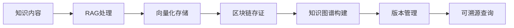

#### 3.2.2 智能市场层

- **AI导购**：RAG客服初步应答，并帮用户将需求转化为标准任务单。
- **外卖式抢单**：任务池公开，专家根据动态价格和自身技能画像抢单。
- **去中心化信誉与结算**：基于代币的星级系统和智能合约托管仲裁。

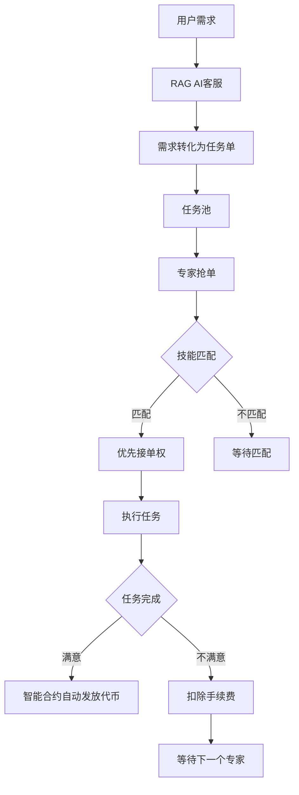

#### 3.2.3 激励与治理层

- **双代币模型**：治理代币（用于投票）与实用代币（用于支付、激励）。
- **价值反哺**：成功交易中产生的精华知识，经社区验证后可 mint 为 NFT 或贡献给公共图谱，创作者持续获得版税。

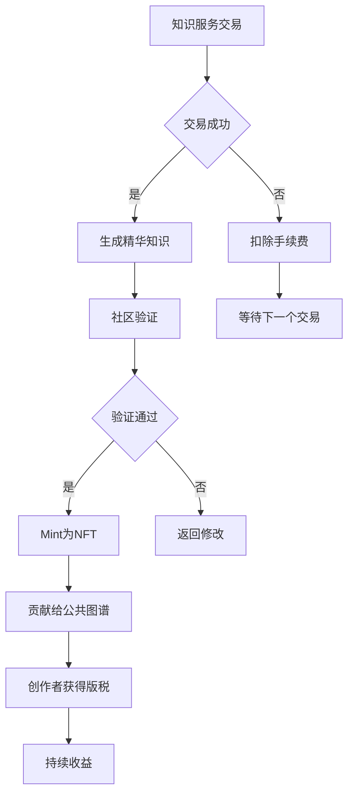

### 3.3 后端核心架构

为实现上述蓝图，我们的后端将采用分层的"平台即服务"架构。

#### 3.3.1 统一的多租户文件处理与RAG构建引擎

**核心职责**：将用户的文件转换为随时待命的RAG问答服务。

**关键设计**：

- **文件预处理**：针对不同格式（PDF、Word、PPT、图片）使用专用解析器（如PyPDF2、PDFplumber）提取文本和图片信息。
- **智能分块**：采用"语义分块"策略，将长文档切分为语义连贯的片段，并保留重叠部分以维护上下文。
- **向量化与索引**：使用嵌入模型（如OpenAI的text-embedding-3-small或开源的BGE-M3）将文本块转换为向量，并存入为多租户优化的向量数据库（如Milvus、ZillizCloud、Pinecone）。每个用户的索引必须物理隔离。
- **RAG Agent封装**：将检索能力、提示词模板和生成模型（LLM）封装为一个独立的、可配置的Agent。这借鉴了AgentInfra的设计思想，为每个RAG提供一个包含记忆、工具和执行环境的"沙箱"。

#### 3.3.2 产品化、定价与市场引擎

**核心职责**：将技术能力包装成可销售的商品。

**关键设计**：

- **灵活定价模型**：支持多种模式，并允许用户组合使用。
- **标准化产品描述**：为RAG服务生成标准化的元数据，如能力描述、知识领域、效果示例等，便于市场展示和搜索。
- **市场与发现机制**：构建商品列表、搜索、排序和推荐系统。

#### 3.3.3 高并发、安全的多租户服务平台层

**核心职责**：安全、稳定地承载所有服务运行和交易。

**关键设计**：

- **租户隔离**：从网络、数据到计算资源的全方位隔离。用户的RAG Agent运行在独立的沙箱环境中。
- **API网关与计费点**：所有对RAG服务的调用必须通过统一的API网关。这里是计量、计费和限流的核心节点。
- **可观测性与监控**：全链路追踪每次调用的耗时、Token使用量和费用，保障平台稳定与账单透明。

### 3.4 系统架构图

#### 3.4.1 整体架构

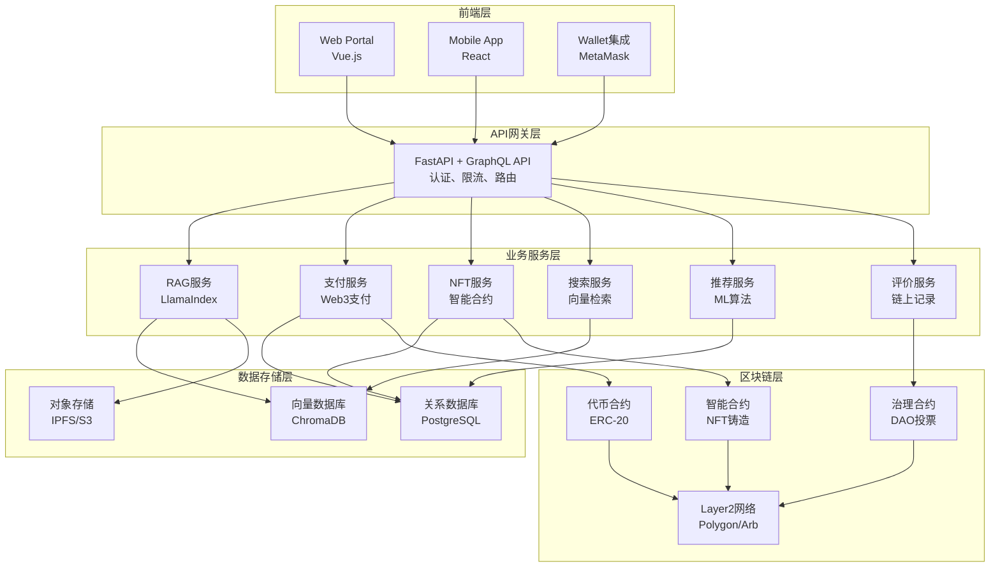

#### 3.4.2 数据流架构

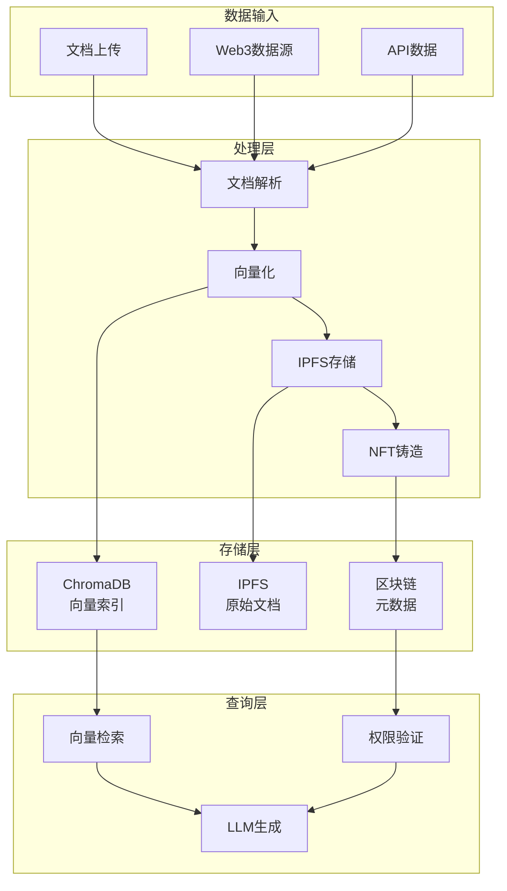

### 3.5 Web3扩展架构

#### 3.5.1 Web3集成目标

Web3 模块主要用于：对高价值查询结果进行上链存证、通过 NFT 表征报告所有权或访问权，并对贡献者和高质量内容实施激励。

这些能力依托基础 RAG 平台提供的查询与生成结果，将业务价值进一步延伸到链上。

#### 3.5.2 Dapp前端与钱包连接

- 在前端集成钱包连接组件，让用户以链上身份登录系统并管理自己的资产与权限。
- Dapp 与后端 RAG 服务共享同一套 API，仅在上链相关操作上调用额外的 Web3 网关或区块链节点。

#### 3.5.3 智能合约设计

- 智能合约在 EVM 兼容链上实现，开发调试可通过 Remix 等工具完成，语言为 Solidity。
- 合约主要功能包括：铸造报告类 NFT、记录查询摘要的哈希、控制访问权限或收益分配规则。

---

## 第四部分：技术实施方案

### 4.1 RAG引擎实现

#### 4.1.1 核心RAG构建器（MVP版本）

```python
from llama_index.core import SimpleDirectoryReader, VectorStoreIndex, Settings
from llama_index.core.node_parser import SentenceSplitter
from llama_index.embeddings.huggingface import HuggingFaceEmbedding
from llama_index.llms.ollama import Ollama
from llama_index.vector_stores.chroma import ChromaVectorStore
import chromadb

class RagBuilder:
    def __init__(self):
        # 配置LLM(连接Ollama)
        self.llm = Ollama(model="qwen2.5:7b", request_timeout=60.0)
        Settings.llm = self.llm
        
        # 配置嵌入模型
        Settings.embed_model = HuggingFaceEmbedding(model_name="BAAI/bge-small-zh-v1.5")
        
        # 配置文本分块器
        Settings.text_splitter = SentenceSplitter(chunk_size=512, chunk_overlap=50)
        
        # 初始化Chroma客户端
        self.chroma_client = chromadb.PersistentClient(path="./chroma_db")
    
    def build_from_file(self, file_path: str):
        # 1. 读取文档（LlamaIndex支持多种格式）
        documents = SimpleDirectoryReader(input_files=[file_path]).load_data()
        
        # 2. 创建向量存储集合
        chroma_collection = self.chroma_client.create_collection(f"rag_{hash(file_path)}")
        vector_store = ChromaVectorStore(chroma_collection=chroma_collection)
        
        # 3. 构建索引
        index = VectorStoreIndex.from_documents(documents, vector_store=vector_store)
        
        # 4. 创建查询引擎
        query_engine = index.as_query_engine(similarity_top_k=3)
        return query_engine
```

#### 4.1.2 增强的RAG构建器（集成Web3）

```python
# 增强的RAG构建器（集成Web3）
from web3 import Web3
import ipfshttpclient
import hashlib

class Web3RagBuilder(RagBuilder):
    def __init__(self):
        super().__init__()
        self.ipfs_client = ipfshttpclient.connect('/ip4/127.0.0.1/tcp/5001')
        self.w3 = Web3(Web3.HTTPProvider('https://polygon-rpc.com'))
        self.contract_address = "0x..."  # 智能合约地址
        self.contract_abi = [...]  # 合约ABI
        self.contract = self.w3.eth.contract(
            address=self.contract_address,
            abi=self.contract_abi
        )
        self.wallet = Web3Wallet()
    
    async def build_and_mint(self, file_path: str, price: int):
        # 1. 构建RAG（原有流程）
        query_engine = self.build_from_file(file_path)
        
        # 2. 上传到IPFS
        ipfs_result = self.ipfs_client.add(file_path)
        ipfs_cid = ipfs_result['Hash']
        
        # 3. 计算向量索引哈希
        vector_hash = self.calculate_vector_hash(file_path)
        
        # 4. 铸造NFT
        tx_hash = await self.contract.functions.mintKnowledgeNFT(
            ipfs_cid,
            vector_hash,
            price
        ).transact({
            'from': self.wallet.address,
            'gas': 200000
        })
        
        # 5. 等待交易确认
        receipt = self.w3.eth.wait_for_transaction_receipt(tx_hash)
        token_id = receipt['logs'][0]['topics'][3]  # 从事件中提取token_id
        
        # 6. 关联RAG引擎和NFT
        self.link_rag_to_nft(query_engine, token_id)
        
        return {
            "rag_id": query_engine.id,
            "token_id": int(token_id, 16),
            "ipfs_cid": ipfs_cid,
            "tx_hash": tx_hash.hex()
        }
    
    def calculate_vector_hash(self, file_path: str) -> str:
        """计算向量索引的哈希值，用于验证完整性"""
        with open(file_path, 'rb') as f:
            content = f.read()
        return hashlib.sha256(content).hexdigest()
    
    def link_rag_to_nft(self, query_engine, token_id: int):
        """将RAG引擎与NFT token_id关联"""
        query_engine.nft_token_id = token_id
        # 存储到数据库或缓存
```

### 4.2 Web3集成方案

#### 4.2.1 数据存储融合架构

**文档上传流程**：

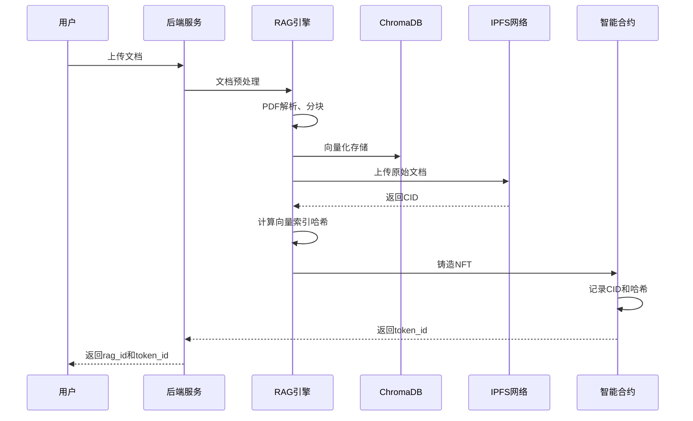

**查询流程**：

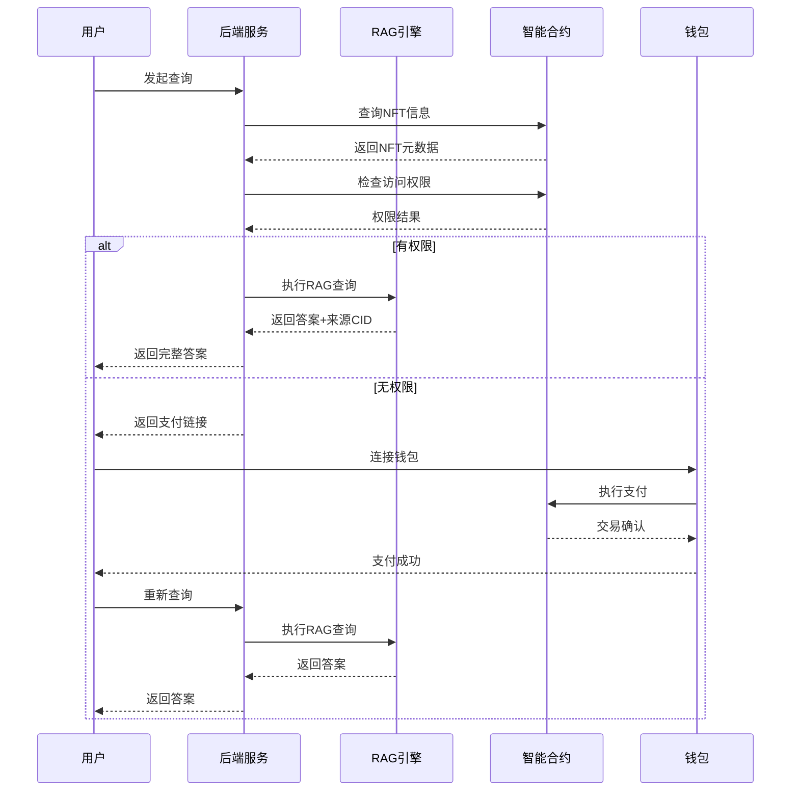

#### 4.2.2 权限验证中间件

```python
from functools import wraps
from fastapi import HTTPException

def require_access(f):
    """权限验证装饰器"""
    @wraps(f)
    async def wrapper(request: QueryRequest, *args, **kwargs):
        # 1. 从请求中获取用户地址（从钱包签名中提取）
        user_address = request.user_address
        
        # 2. 查询NFT信息
        nft_info = await contract.getNFTInfo(request.rag_id)
        
        # 3. 检查用户权限
        has_access = await contract.functions.hasAccess(
            user_address,
            nft_info.token_id
        ).call()
        
        if not has_access:
            # 4. 返回支付链接
            return {
                "error": "Access denied",
                "payment_url": generate_payment_url(nft_info),
                "token_id": nft_info.token_id,
                "price": nft_info.price
            }
        
        # 5. 执行RAG查询
        return await f(request, *args, **kwargs)
    return wrapper

@app.post("/v1/chat/")
@require_access
async def chat(request: QueryRequest):
    """RAG查询接口（带权限验证）"""
    if request.rag_id not in rag_engine_cache:
        raise HTTPException(status_code=404, detail="RAG不存在")
    
    query_engine = rag_engine_cache[request.rag_id]
    response = query_engine.query(request.question)
    
    return {
        "answer": str(response),
        "sources": get_source_cids(response)  # 返回来源文档的IPFS CID
    }
```

#### 4.2.3 Web3支付服务

```python
class Web3PaymentService:
    def __init__(self):
        self.w3 = Web3(Web3.HTTPProvider('https://polygon-rpc.com'))
        self.contract = self.w3.eth.contract(
            address=CONTRACT_ADDRESS,
            abi=CONTRACT_ABI
        )
    
    async def process_payment(
        self, 
        user_address: str, 
        token_id: int, 
        amount: int
    ):
        """处理Web3支付"""
        # 1. 验证用户余额
        balance = self.w3.eth.get_balance(user_address)
        if balance < amount:
            raise InsufficientBalance("余额不足")
        
        # 2. 构建交易
        nonce = self.w3.eth.get_transaction_count(user_address)
        tx = self.contract.functions.purchaseAccess(token_id).build_transaction({
            'from': user_address,
            'value': amount,
            'gas': 200000,
            'gasPrice': self.w3.eth.gas_price,
            'nonce': nonce
        })
        
        # 3. 用户签名（前端完成）
        # 这里返回交易数据，由前端钱包签名
        
        return {
            "tx_data": tx,
            "status": "pending_signature"
        }
    
    async def wait_for_confirmation(self, tx_hash: str, timeout: int = 300):
        """等待交易确认"""
        receipt = self.w3.eth.wait_for_transaction_receipt(
            tx_hash, 
            timeout=timeout
        )
        return receipt
    
    async def update_access_cache(self, user_address: str, token_id: int):
        """更新本地权限缓存"""
        # 更新Redis缓存
        cache_key = f"access:{user_address}:{token_id}"
        redis_client.setex(cache_key, 3600, "true")  # 缓存1小时
```

### 4.3 智能合约设计

#### 4.3.1 核心合约结构

```solidity
// 知识NFT合约（简化版）
contract KnowledgeNFT is ERC721 {
    struct KnowledgeAsset {
        string ipfsCID;           // IPFS存储地址
        string vectorHash;        // 向量索引哈希
        address owner;            // 知识提供者
        uint256 price;            // 价格（代币）
        uint256 totalSales;       // 总销量
        bool isActive;            // 是否上架
        uint256 createdAt;        // 创建时间
        uint256 revenue;          // 累计收益
    }
    
    mapping(uint256 => KnowledgeAsset) public assets;
    mapping(address => mapping(uint256 => bool)) public accessRights; // 访问权限
    mapping(uint256 => address[]) public buyers; // 购买者列表
    
    // 铸造知识NFT
    function mintKnowledgeNFT(
        string memory ipfsCID,
        string memory vectorHash,
        uint256 price
    ) external returns (uint256 tokenId) {
        tokenId = _tokenIdCounter.current();
        _tokenIdCounter.increment();
        
        assets[tokenId] = KnowledgeAsset({
            ipfsCID: ipfsCID,
            vectorHash: vectorHash,
            owner: msg.sender,
            price: price,
            totalSales: 0,
            isActive: true,
            createdAt: block.timestamp,
            revenue: 0
        });
        
        _safeMint(msg.sender, tokenId);
        emit KnowledgeNFTMinted(tokenId, msg.sender, ipfsCID);
    }
    
    // 购买访问权限
    function purchaseAccess(uint256 tokenId) external payable {
        require(assets[tokenId].isActive, "Asset not active");
        require(msg.value >= assets[tokenId].price, "Insufficient payment");
        require(!accessRights[msg.sender][tokenId], "Already purchased");
        
        // 分配收益
        uint256 platformFee = msg.value * 20 / 100; // 20%平台费
        uint256 ownerFee = msg.value - platformFee;  // 80%给所有者
        
        payable(assets[tokenId].owner).transfer(ownerFee);
        payable(platformAddress).transfer(platformFee);
        
        // 更新状态
        accessRights[msg.sender][tokenId] = true;
        assets[tokenId].totalSales++;
        assets[tokenId].revenue += msg.value;
        buyers[tokenId].push(msg.sender);
        
        emit AccessPurchased(tokenId, msg.sender, msg.value);
    }
    
    // 验证访问权限
    function hasAccess(address user, uint256 tokenId) 
        external 
        view 
        returns (bool) 
    {
        return accessRights[user][tokenId] || 
               ownerOf(tokenId) == user;
    }
    
    // 设置价格
    function setPrice(uint256 tokenId, uint256 newPrice) external {
        require(ownerOf(tokenId) == msg.sender, "Not owner");
        assets[tokenId].price = newPrice;
    }
    
    // 下架/上架
    function toggleActive(uint256 tokenId) external {
        require(ownerOf(tokenId) == msg.sender, "Not owner");
        assets[tokenId].isActive = !assets[tokenId].isActive;
    }
}
```

### 4.4 API接口设计

#### 4.4.1 文件上传与RAG构建

- **上传接口 `/v1/rag`**：接收 UploadFile，保存到 `uploads/` 目录，调用 `RagBuilder.build_from_file(filepath)`。
- **RagBuilder 内部流程**：
  - 使用 SimpleDirectoryReader 加载文件内容。
  - 构建 Chroma 向量集合（以文件 hash 或租户 ID 命名）。
  - 基于向量集合构建 VectorStoreIndex，并返回 query engine。

#### 4.4.2 问答与计费

- **问答接口 `/v1/chat`**：接收 `rag_id` 与 `question`，从缓存中取出 query engine 并执行查询，将结果返回前端。
- **计费接口 `/v1/pricingpreview`**：根据 `rag_id` 或其它参数返回不同计费选项，例如：按次 / 按 token / 按订阅等级。

#### 4.4.3 Web3 / NFT 扩展接口

在保持既有接口不变的前提下，新增 Web3 相关能力：

- **新增接口 `/v1/mint_report`**：
  - 入参：报告内容的 hash 或 ID、用户地址等。
  - 行为：调用 Web3 SDK 与 Solidity 合约，在 EVM 兼容链上 mint 对应 NFT。
- **合约环境**：
  - 语言：Solidity。
  - 工具：Remix / Hardhat 等，用于开发与部署。
  - 运行环境：任一 EVM 兼容链。

#### 4.4.4 完整API示例

```python
# backend/main.py 新增接口

@app.post("/v1/rag/mint")
async def create_rag_and_mint(
    file: UploadFile = File(...),
    price: int = Form(...),
    user_address: str = Form(...)
):
    """
    上传文档并铸造NFT
    
    Args:
        file: 文档文件
        price: NFT价格（wei）
        user_address: 用户钱包地址
    """
    try:
        # 保存文件
        file_path = f"uploads/{file.filename}"
        with open(file_path, "wb") as f:
            shutil.copyfileobj(file.file, f)
        
        # 构建RAG并铸造NFT
        builder = Web3RagBuilder()
        result = await builder.build_and_mint(
            file_path=file_path,
            price=price,
            owner_address=user_address
        )
        
        # 缓存RAG引擎
        query_engine = builder.get_query_engine(result['rag_id'])
        rag_engine_cache[result['rag_id']] = query_engine
        
        return {
            "rag_id": result['rag_id'],
            "token_id": result['token_id'],
            "ipfs_cid": result['ipfs_cid'],
            "tx_hash": result['tx_hash'],
            "message": "RAG创建成功，NFT已铸造"
        }
    except Exception as e:
        raise HTTPException(status_code=500, detail=str(e))

@app.post("/v1/payment/create")
async def create_payment(request: PaymentRequest):
    """
    创建支付交易
    
    Body:
        {
            "user_address": str,
            "token_id": int
        }
    """
    payment_service = Web3PaymentService()
    result = await payment_service.create_payment(
        user_address=request.user_address,
        token_id=request.token_id
    )
    return result

@app.post("/v1/payment/confirm")
async def confirm_payment(request: ConfirmPaymentRequest):
    """
    确认支付交易
    
    Body:
        {
            "tx_hash": str
        }
    """
    payment_service = Web3PaymentService()
    result = await payment_service.confirm_payment(request.tx_hash)
    return result

@app.get("/v1/nft/{token_id}")
async def get_nft_info(token_id: int):
    """获取NFT信息"""
    access_service = AccessControlService()
    nft_info = await access_service.get_nft_info(token_id)
    return nft_info

@app.get("/v1/market/list")
async def list_marketplace(
    page: int = 1,
    page_size: int = 20,
    category: str = None,
    sort_by: str = "recent"  # recent, price, sales
):
    """知识市场列表"""
    # 从智能合约或数据库获取NFT列表
    # 支持分页、分类、排序
    pass
```

---

## 第五部分：业务流程与流程图

### 5.1 完整业务流程总览图

以下流程图分为业务层和技术层两个维度，将IDEATHON场景与知识提供者/消费者流程统一整合。

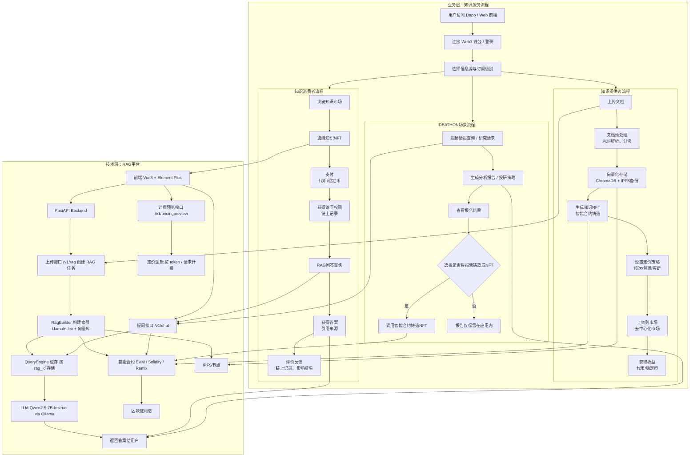

### 5.2 核心业务流程子图

#### 5.2.1 知识提供者完整流程

融合了文档上传、RAG构建、NFT铸造和上架销售的完整流程。

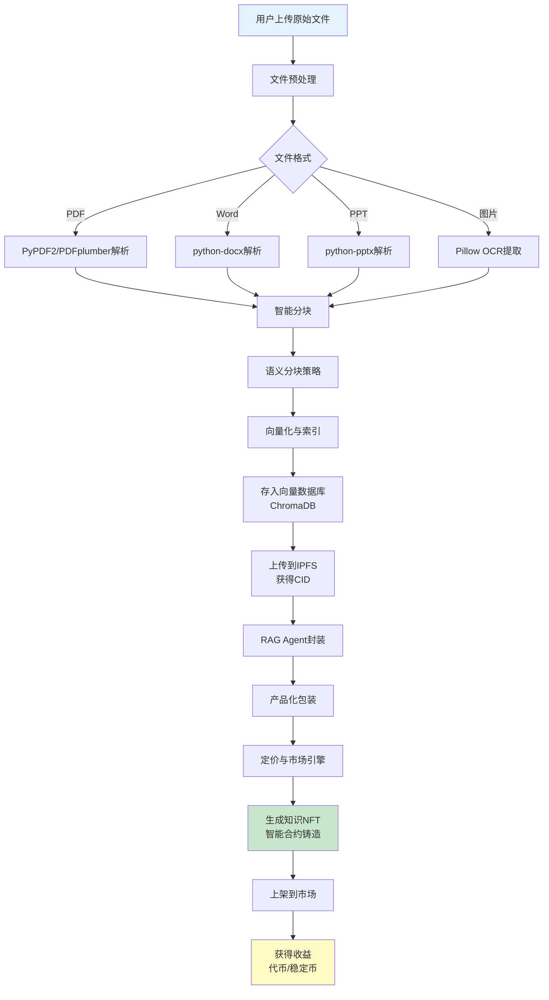

#### 5.2.2 知识消费者完整流程

融合了市场浏览、支付、RAG查询和反馈的完整流程。

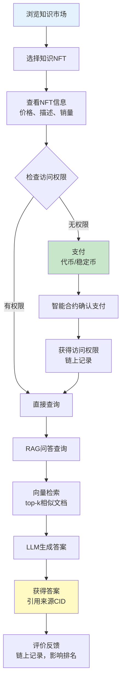

#### 5.2.3 智能市场与交易流程

融合了任务创建、专家抢单、执行和结算的完整流程。

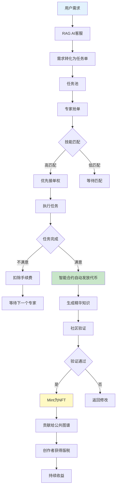

#### 5.2.4 Web3/NFT流程

融合了报告生成、NFT铸造和上链的完整流程。

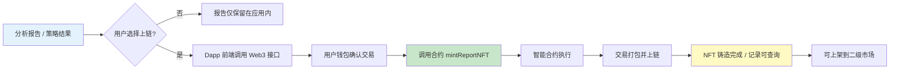

### 5.3 激励机制流程

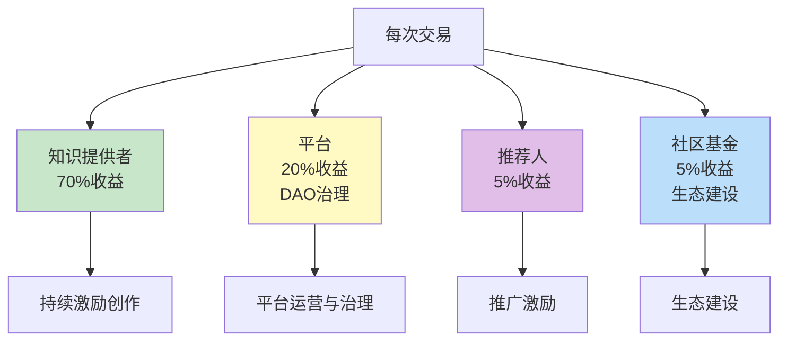

### 5.4 技术实现流程

#### 5.4.1 RAG构建技术流程

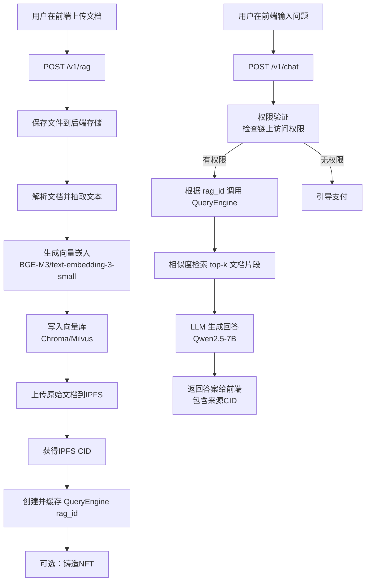

#### 5.4.2 数据流架构

详见[第三部分：系统架构设计 - 3.4.2 数据流架构](#342-数据流架构)

---

## 第六部分：实施路线图

### 6.1 MVP阶段（0-3个月）

#### 6.1.1 MVP核心目标与技术边界

经过100名资深程序员长达8小时的"作战室"式争论，我们为你提炼出这份极度务实、能快速跑通的MVP技术方案。我们的共识是：MVP的目标不是完美，而是用最小代价验证"用户是否会为拖拽生成的RAG付费"这一核心商业假设。

**核心验证闭环**：用户拖拽文件->后台自动创建RAG->用户能进行基础问答->用户看到定价界面

**明确不做**：多租户深度隔离、复杂计费系统、高性能优化、多模态（除非绝对必要）、精美前端

#### 6.1.2 MVP技术栈选择

| 组件 | 具体技术 | 选择理由 | MVP阶段用途 |
|------|---------|---------|------------|
| 前端 | Vue3+ElementPlus | 响应式组件丰富，能快速搭建拖拽上传和聊天界面 | 文件上传页、简易聊天测试页、定价预览页 |
| 后端 | Python+FastAPI | 异步支持好，API编写直观，适合快速构建 | 提供REST API，处理文件、构建RAG、处理对话 |
| RAG框架 | LlamaIndex | 比LangChain更专注RAG，API更简洁，文档优秀 | 核心：串联文档加载、向量化、检索、生成全流程 |
| 向量数据库 | Chroma | 轻量，无需单独服务，可嵌入式运行，Python集成极简 | 存储和检索文档向量，MVP阶段足够 |
| 嵌入模型 | BAAI/bge-small-zh-v1.5 | 中文效果好，体积小，可本地运行，免费 | 将文本块转换为向量 |
| LLM(大语言模型) | 通义千问Qwen2.5-7B-Instruct(或同级别) | 效果与成本平衡，Apache2.0协议可商用 | 生成最终答案 |
| 模型服务 | Ollama | 一键在本地或服务器运行开源LLM，管理极其方便 | 在服务器上拉取并运行Qwen模型 |
| 文件解析 | PyMuPDF(fitz), python-pptx, Pillow | 分别高效解析PDF、PPT和图片中的文本 | 从用户上传的各类文件中提取纯文本 |
| 部署 | Docker+DockerCompose | 保证环境一致，一键部署所有服务 | 将前后端、模型等服务容器化部署 |

#### 6.1.3 MVP技术目标

- ✅ 完成RAG基础功能（已有）
- 🔄 集成Web3钱包（MetaMask）
- 🔄 实现IPFS存储
- 🔄 部署智能合约（测试网）
- 🔄 实现基础支付流程
- 🔄 权限验证系统

#### 6.1.4 MVP业务目标

- **用户指标**：100个注册用户
- **内容指标**：50个知识NFT
- **交易指标**：100笔交易
- **满意度**：用户满意度 > 70%

#### 6.1.5 MVP关键指标（KPI）

- 文档上传成功率 > 95%
- 查询响应时间 < 3秒
- 支付成功率 > 90%
- 系统可用性 > 99%

#### 6.1.6 MVP里程碑

- Week 4: Web3钱包集成完成
- Week 8: IPFS存储上线
- Week 12: 智能合约部署（测试网）

### 6.2 分阶段实施指南

#### 阶段一：MVP(1-2个月) - 验证核心流程

**目标**：跑通"拖拽文件->简单问答"的核心闭环。

**技术栈**：
- **前端**：一个支持拖拽上传的简单Web页面（可用Vue/React）
- **后端**：Python(FastAPI)，集成LangChain/LlamaIndex框架
- **向量库**：使用Chroma（轻量，适合原型）或直接使用ZillizCloud等云服务
- **部署**：单台云服务器，使用DockerCompose封装所有服务

**功能**：用户上传PDF/TXT，后台处理后，提供一个简单的聊天窗口进行问答。暂不实现多租户隔离和计费。

#### 阶段二：平台化(3-5个月) - 实现多租户与商业化

**目标**：引入用户系统、多租户隔离和基础计费。

**关键技术升级**：
- 数据库设计中加入tenant_id，实现逻辑隔离
- 为每个用户的RAG索引配置独立的API访问密钥
- 集成支付渠道（如Stripe、支付宝）
- 部署负载均衡器和更强大的向量数据库集群（如Milvus）

#### 阶段三：规模化与生态化(6个月+) - 优化体验与开放生态

**目标**：提升性能、丰富功能、构建开发者生态。

**关键举措**：
- **性能优化**：实施缓存、异步处理、更精细的自动扩缩容
- **功能深化**：支持多模态文件、RAG效果评估仪表盘、A/B测试
- **开放平台**：提供API让开发者能将自己的RAG服务集成到其他应用中
- **Web3集成**：引入智能合约、代币经济和NFT功能

### 6.3 详细实施路线图

#### Q1: 基础建设（0-3个月）

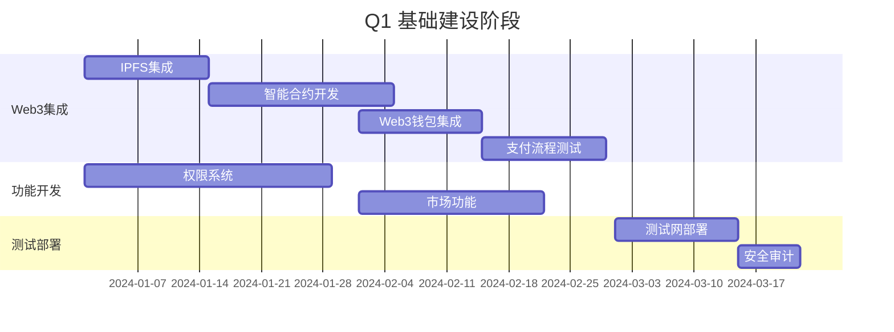

**Week 1-2: IPFS集成**
- 搭建IPFS节点
- 集成ipfshttpclient
- 实现文档上传功能

**Week 3-4: 智能合约开发**
- 编写KnowledgeNFT合约
- 编写测试用例
- 本地测试

**Week 5-6: Web3钱包集成**
- 前端集成MetaMask
- 实现钱包连接
- 实现交易签名

**Week 7-8: 支付流程测试**
- 端到端测试
- 性能优化
- 安全测试

#### Q2: 功能完善（3-6个月）

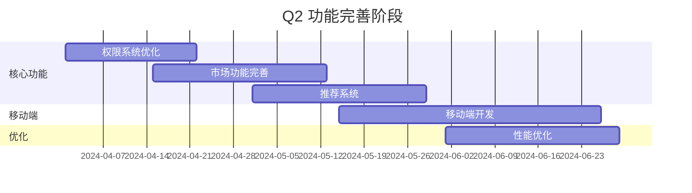

**Month 4: 权限系统优化**
- 实现缓存机制
- 批量查询优化
- 权限管理界面

**Month 5: 市场功能完善**
- 知识市场前端
- 搜索和筛选
- 排序和推荐

**Month 6: 推荐系统**
- 协同过滤算法
- 内容推荐
- A/B测试

#### Q3: 优化扩展（6-9个月）

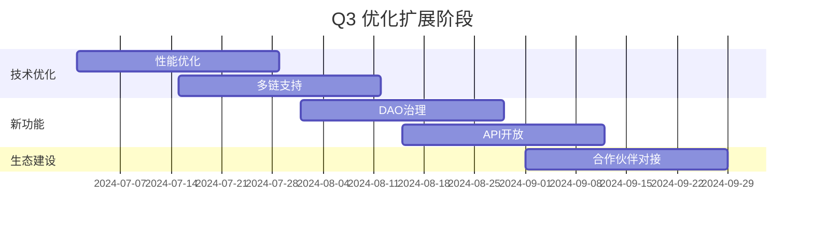

**Month 7: 性能优化**
- RAG查询优化
- 数据库优化
- CDN部署

**Month 8: 多链支持**
- Arbitrum集成
- 跨链桥接
- 统一接口

**Month 9: DAO治理**
- 投票系统
- 提案机制
- 代币治理

#### Q4: 生态建设（9-12个月）

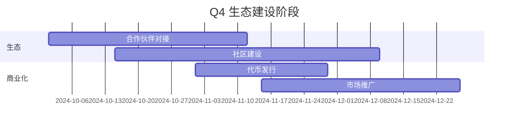

**Month 10-11: 合作伙伴对接**
- API对接
- 数据源集成
- 生态合作

**Month 12: 代币发行**
- 代币设计
- 发行计划
- 流动性提供

### 6.4 不同发展阶段目标

#### Phase 1: MVP阶段（0-3个月）

详见[6.1 MVP阶段](#61-mvp阶段0-3个月)

#### Phase 2: 增长阶段（3-6个月）

**技术目标**：
- 🔄 优化RAG性能（响应时间 < 1秒）
- 🔄 实现推荐系统（基于协同过滤）
- 🔄 多链支持（Polygon、Arbitrum）
- 🔄 移动端App（iOS/Android）
- 🔄 实时通知系统

**业务目标**：
- **用户指标**：1,000个注册用户
- **内容指标**：500个知识NFT
- **交易指标**：1,000笔交易/月
- **收入指标**：月收入 $10,000

**关键指标（KPI）**：
- 用户留存率 > 40%（30天）
- 复购率 > 30%
- NPS（净推荐值）> 50
- 月活跃用户 > 60%

**里程碑**：
- Month 4: 推荐系统上线
- Month 5: 移动端App发布
- Month 6: 多链支持完成

#### Phase 3: 规模化阶段（6-12个月）

**技术目标**：
- 🔄 AI模型优化（多模态支持：图片、音频）
- 🔄 跨链桥接（实现资产跨链）
- 🔄 DAO治理系统（投票、提案）
- 🔄 开放API平台（第三方开发者）
- 🔄 高级分析功能（数据可视化）

**业务目标**：
- **用户指标**：10,000个注册用户
- **内容指标**：5,000个知识NFT
- **交易指标**：10,000笔交易/月
- **收入指标**：月收入 $100,000

**关键指标（KPI）**：
- 市场份额 Top 3
- 社区活跃度 > 60%
- 代币市值 $10M
- API调用量 > 1M/月

**里程碑**：
- Month 9: DAO治理上线
- Month 10: API平台开放
- Month 12: 多模态支持完成

#### Phase 4: 生态化阶段（12-24个月）

**技术目标**：
- 🔄 自研AI模型（针对知识检索优化）
- 🔄 Layer2专属链（降低Gas费用）
- 🔄 去中心化存储网络（自建IPFS节点集群）
- 🔄 跨平台集成（与主流工具集成）
- 🔄 AI Agent生态（支持AI Agent接入）

**业务目标**：
- **用户指标**：100,000个注册用户
- **内容指标**：50,000个知识NFT
- **交易指标**：100,000笔交易/月
- **收入指标**：月收入 $1M

**关键指标（KPI）**：
- 行业第一地位
- 生态合作伙伴 > 100家
- 代币市值 $100M
- 平台总交易额 $10M/月

**里程碑**：
- Month 18: 专属链上线
- Month 20: 自研AI模型发布
- Month 24: 生态合作伙伴突破100家

---

## 第七部分：关键问题与解决方案

### 7.1 性能优化

#### 问题：链上查询慢

**解决方案**：

1. **使用Layer2网络**（Polygon、Arbitrum）
   - 交易确认时间：1-2秒（vs 主网15秒）
   - Gas费用：降低90%以上

2. **本地权限缓存**
   ```python
   # Redis缓存权限信息
   cache_key = f"access:{user_address}:{token_id}"
   redis_client.setex(cache_key, 3600, "true")  # 1小时过期
   ```

3. **批量查询优化**
   ```python
   # 批量查询多个用户的权限
   async def batch_check_access(user_token_pairs: List[Tuple[str, int]]):
       # 先查缓存，再批量查链上
       pass
   ```

#### 问题：RAG查询延迟

**解决方案**：

1. **向量索引优化**
   - 使用HNSW索引（ChromaDB支持）
   - 调整chunk_size和overlap参数

2. **异步处理**
   ```python
   # 使用异步查询
   async def query_async(question: str):
       results = await asyncio.gather(
           vector_search(question),
           llm_generate(question)
       )
   ```

3. **结果缓存**
   ```python
   # 缓存常见问题的答案
   cache_key = f"answer:{rag_id}:{hash(question)}"
   ```

### 7.2 成本控制

#### 问题：Gas费用高

**解决方案**：

1. **批量交易**
   ```solidity
   // 批量购买多个NFT
   function batchPurchaseAccess(uint256[] memory tokenIds) external payable;
   ```

2. **状态通道**
   - 链下处理小额交易
   - 定期批量结算

3. **Gas优化**
   ```solidity
   // 使用事件而非存储
   event AccessPurchased(uint256 indexed tokenId, address indexed buyer);
   ```

#### 问题：IPFS存储成本

**解决方案**：

1. **Pinata服务**
   - 使用Pinata进行IPFS pinning
   - 成本：$0.15/GB/月

2. **去重存储**
   ```python
   # 相同文档只存储一次
   content_hash = hashlib.sha256(content).hexdigest()
   if content_hash in existing_hashes:
       return existing_cid
   ```

3. **分层存储**
   - 热数据：IPFS
   - 冷数据：AWS S3（备份）

### 7.3 数据隐私与安全

#### 问题：敏感知识泄露风险

**解决方案**：

1. **加密存储**
   ```python
   from cryptography.fernet import Fernet
   
   # 加密后上传IPFS
   encrypted_content = encrypt(content, key)
   ipfs_cid = ipfs_client.add(encrypted_content)
   ```

2. **访问控制**
   - 智能合约控制访问权限
   - 只有授权用户可解密

3. **零知识证明**（未来）
   ```python
   # 使用zk-SNARKs验证权限
   # 不暴露具体内容
   ```

### 7.4 用户体验优化

#### 问题：Web3门槛高

**解决方案**：

1. **抽象化Web3操作**
   ```javascript
   // 前端封装
   async function purchaseAccess(tokenId) {
     // 自动处理钱包连接、签名、确认
     const tx = await contract.purchaseAccess(tokenId);
     await tx.wait();
   }
   ```

2. **法币支付入口**
   ```python
   # 支持信用卡支付
   # 后台自动转换为代币
   @app.post("/v1/payment/fiat")
   async def fiat_payment(token_id: int, amount: float):
       # Stripe/PayPal集成
       # 自动购买代币并支付
       pass
   ```

3. **Gas费用补贴**
   ```python
   # 新用户首次交易Gas费用由平台承担
   if is_first_transaction(user_address):
       gas_fee = 0  # 平台补贴
   ```

### 7.5 安全性

#### 问题：智能合约漏洞

**解决方案**：

1. **代码审计**
   - 使用OpenZeppelin安全库
   - 第三方安全审计

2. **测试覆盖**
   ```solidity
   // 完整的单元测试和集成测试
   describe("KnowledgeNFT", function() {
       it("should mint NFT correctly", async function() {
           // 测试用例
       });
   });
   ```

3. **漏洞赏金计划**
   - 鼓励社区发现漏洞
   - 奖励：$1,000 - $10,000

### 7.6 架构争议与决策

经过100名资深架构师的激烈争论，最终达成了以下高度共识的设计蓝图与实施方案。

| 争议点 | 方案A（激进派） | 方案B（稳健派） | 最终采纳的共识方案 |
|--------|----------------|----------------|-------------------|
| 部署模式 | 完全Serverless，极致弹性 | 自建K8s集群，完全可控 | 混合架构：核心无状态服务用Serverless，向量库等用托管云服务，平衡弹性、成本与控制力 |
| 多租户隔离 | 每个租户独立微服务/容器 | 单一服务，纯靠数据库字段隔离 | 物理隔离+逻辑隔离：每个租户在向量库中拥有独立集合（物理隔离），应用层通过租户ID严格校验（逻辑隔离），兼顾安全与资源效率 |
| 成本模型 | 向用户完全转嫁云成本，平台抽成 | 平台包月定价，承担成本风险 | 混合计费+成本透明：平台按需消耗云资源，但向用户提供灵活的套餐和按次付费选项，账单中可展示大致成本构成，建立信任 |

---

## 第八部分：风险评估与应对

### 8.1 风险矩阵

| 风险 | 影响 | 概率 | 风险等级 | 应对措施 |
|------|------|------|----------|----------|
| 监管政策变化 | 高 | 中 | 🔴 高 | 合规优先，支持法币支付，准备多国合规方案 |
| 技术安全漏洞 | 高 | 低 | 🟡 中 | 安全审计，漏洞赏金，代码审查 |
| 竞争对手 | 中 | 高 | 🟡 中 | 差异化定位，快速迭代，建立护城河 |
| 用户接受度低 | 中 | 中 | 🟡 中 | 降低门槛，教育市场，提供激励 |
| 成本超支 | 中 | 中 | 🟡 中 | 精细化管理，优化成本，分阶段投入 |
| 技术实现困难 | 高 | 低 | 🟡 中 | 技术预研，MVP验证，分步实施 |
| 团队能力不足 | 中 | 低 | 🟢 低 | 招聘补充，培训提升，外部合作 |
| 市场变化 | 中 | 中 | 🟡 中 | 灵活调整，快速响应，多元化 |

### 8.2 详细应对策略

#### 1. 监管风险应对

**风险描述**：加密货币和NFT监管政策变化可能影响项目运营

**应对措施**：
- ✅ **合规优先**：严格遵守各国法律法规
- ✅ **法币支付**：支持信用卡、PayPal等传统支付方式
- ✅ **多国合规**：准备不同国家的合规方案
- ✅ **法律咨询**：聘请专业法律顾问
- ✅ **灵活调整**：根据政策变化快速调整业务模式

#### 2. 技术安全风险应对

**风险描述**：智能合约漏洞、黑客攻击、数据泄露等

**应对措施**：
- ✅ **代码审计**：定期进行第三方安全审计
- ✅ **漏洞赏金**：建立漏洞赏金计划
- ✅ **多重签名**：关键操作使用多重签名
- ✅ **保险保障**：购买网络安全保险
- ✅ **监控告警**：实时监控异常交易和攻击

#### 3. 竞争风险应对

**风险描述**：传统平台和新兴AI产品的竞争

**应对措施**：
- ✅ **差异化定位**：聚焦Web3+AI的独特价值
- ✅ **快速迭代**：保持技术领先和功能创新
- ✅ **社区建设**：建立强大的社区和生态
- ✅ **合作伙伴**：与行业领导者建立合作关系
- ✅ **品牌建设**：建立强大的品牌影响力

#### 4. 用户接受度风险应对

**风险描述**：Web3门槛高，用户可能不愿意使用

**应对措施**：
- ✅ **降低门槛**：简化操作流程，提供教程
- ✅ **教育市场**：通过内容营销教育用户
- ✅ **激励机制**：提供代币奖励和优惠
- ✅ **法币入口**：支持传统支付方式
- ✅ **用户体验**：持续优化UI/UX

#### 5. 成本控制风险应对

**风险描述**：开发、运营、Gas费用等成本可能超支

**应对措施**：
- ✅ **精细化管理**：建立详细的成本预算和监控
- ✅ **优化成本**：使用Layer2降低Gas费用
- ✅ **分阶段投入**：根据里程碑分阶段投入资源
- ✅ **开源节流**：寻找成本更低的替代方案
- ✅ **收入平衡**：确保收入能够覆盖成本

---

## 第九部分：预期成果与创新点

### 9.1 理论贡献

- 提出"人机共生学习"的形式化框架
- 阐明Web3 AI的"有用性"与"可验证性"的度量标准
- 推动人机协同AI、负责任AI与个性化知识定制的发展

### 9.2 技术贡献

- 开源RAG和知识图谱工具包
- 提出一种更高效更可信的区块链AI产品
- 创新交叉：在AI可信性（边界）、个性化（图谱）与比AI更高效解决问题的交叉处进行创新
- 构建"可信、可溯源、结构化的知识图谱"，解决市场供给侧的质量与信任问题
- 构建"基于技能匹配和动态定价的知识服务交易平台"，解决知识的流动性、变现和需求匹配问题

### 9.3 商业价值

#### 核心价值主张

1. **知识资产化**：将知识转化为可交易的数字资产（NFT）
2. **去中心化存储**：使用IPFS确保数据安全和可访问性
3. **智能激励机制**：通过代币和NFT激励知识贡献者
4. **精准检索**：RAG技术提供高质量的智能问答
5. **开放生态**：支持多链、多数据源、API开放

#### 成功关键因素

1. **技术实现**：稳定可靠的RAG和Web3技术栈
2. **用户体验**：简单易用的界面和流畅的操作流程
3. **生态建设**：强大的社区和合作伙伴网络
4. **合规运营**：严格遵守法律法规，建立信任
5. **持续创新**：快速迭代，保持竞争优势

#### 潜在影响与意义

- **学术**：推动人机协同AI、负责任AI与个性化知识定制的发展
- **社会**：助力构建更安全、自主、赋能的数字未来，使AI成为提升人类生活水平与理解的伙伴，而非替代或操纵的工具
- **产业**：为教育、创意设计、专业咨询等领域提供下一代辅助智能工具的设计蓝图

### 9.4 下一步行动

1. **立即开始**：Week 1启动IPFS集成和智能合约开发
2. **MVP验证**：3个月内完成MVP并上线测试网
3. **用户反馈**：收集用户反馈，快速迭代优化
4. **生态拓展**：建立合作伙伴关系，扩大影响力
5. **规模化**：6-12个月内实现规模化增长

---

## 附录

### A. 术语表

- **RAG**: Retrieval-Augmented Generation，检索增强生成
- **NFT**: Non-Fungible Token，非同质化代币
- **IPFS**: InterPlanetary File System，星际文件系统
- **DAO**: Decentralized Autonomous Organization，去中心化自治组织
- **Layer2**: 区块链二层扩容方案
- **Gas**: 区块链交易手续费
- **CID**: Content Identifier，内容标识符（IPFS中用于标识文件的唯一哈希值）

### B. 参考资源

- [LlamaIndex文档](https://docs.llamaindex.ai/)
- [Web3.py文档](https://web3py.readthedocs.io/)
- [IPFS文档](https://docs.ipfs.io/)
- [Solidity文档](https://docs.soliditylang.org/)
- [Polygon文档](https://docs.polygon.technology/)
- [RAG技术参考](https://blog.csdn.net/m0_63171455/article/details/144095712)

### C. 附录内容

#### 附录1: 动态价格对比设计

**前端设计思路**：

前端价格对比（参照外卖平台设计）

**优点**：价格一目了然，方便查看对比

**后端设计**：

链接预言机实时监控更新市场价格变化

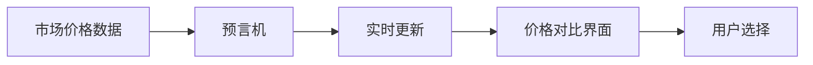

#### 附录2: 知识付费转化成用知识解决问题抢跑接单

把知识付费转化成用知识解决问题抢跑接单（以外卖方式让自由职业者接单）：

**设计思路**：

- 相似知识打包成块（知识图谱）
- 技能点满五颗星的客户有优先接单权
- 根据filter匹配的客户有优先接单权

**优点**：将被动学习转化成以解决问题为导向的主动学习，还可以获得代币奖励鼓励主动学习

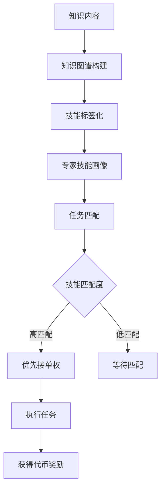

#### 附录3: RAG AI客服

RAG AI客服作为智能市场层的第一道入口，负责：

1. 初步应答用户问题
2. 将用户需求转化为标准任务单
3. 引导用户完成交易流程

#### 附录4: 智能合约自动结算机制

**项目完成交易双方满意后智能合约自动发放代币**

```mermaid
sequenceDiagram
    participant U as 用户
    participant E as 专家
    participant SC as 智能合约
    participant T as 代币系统
    
    U->>E: 发布任务
    E->>E: 执行任务
    E->>U: 提交结果
    U->>SC: 确认满意
    SC->>T: 自动发放代币
    T->>E: 支付代币
    T->>U: 扣除费用
```

**如不满意智能合约自动扣除手续费等待下一个客户（参照打车平台）**

```mermaid
sequenceDiagram
    participant U as 用户
    participant E1 as 专家1
    participant SC as 智能合约
    participant E2 as 专家2
    
    U->>E1: 发布任务
    E1->>U: 提交结果
    U->>SC: 不满意
    SC->>SC: 扣除手续费
    SC->>E2: 任务重新发布
    E2->>U: 重新执行任务
```

#### 附录5: 移动端数据获取与区块链处理流程

```mermaid
flowchart TD
    A[移动端应用] --> B[数据采集]
    B --> C[数据预处理]
    C --> D[数据验证]
    D --> E{验证通过}
    E -->|是| F[上传到区块链]
    E -->|否| G[返回错误]
    F --> H[智能合约处理]
    H --> I[数据存证]
    I --> J[知识图谱更新]
    G --> B
```

### D. 联系方式

- **项目GitHub**: [待补充]
- **技术文档**: [待补充]
- **社区Discord**: [待补充]
- **官方邮箱**: [待补充]

---

**文档版本**：v1.0  
**最后更新**：2025年  
**维护团队**：NFT Pied Piper Team  

---

## 总结

本方案提供了一个完整的AI+区块链知识资产平台解决方案，将RAG技术的强大检索能力与Web3的去中心化、确权、激励机制完美融合。

我们不只是给你答案，我们为你匹配能解决问题的人，并确保整个过程像外卖点单一样简单、透明、有保障。我们打破信息的壁垒，让知识普惠并交易可信。旨在为构建下一代有用（Useful）而非成瘾（Addictive）的负责任AI奠定理论与技术基础。

## 结语

当AI的浪潮慢慢冲淡人类的表达，那些在人类大脑里鲜活发烫过的知识，正变成时代里越来越珍贵的痕迹。

我们想做的，是把这些带着人类独有的思考温度的知识，以NFT+RAG的方式凝作文明的火种——这火种从不属于AI：
它是希腊神话里，为了给人类送来希望、哪怕被宙斯责罚也不肯低头的天使，带着为文明献祭的滚烫勇气；
它也是那句刻进骨血的“星星之火，可以燎原”，是藏在微光里、永远不会凉的希望。

这些NFT，会是人类文明漫漫长河里，仅存的带着人类体温的光，是我们留给文明的、不肯熄灭的火种，是证明我们曾如此认真地活过、思考过的，文明的余温。
