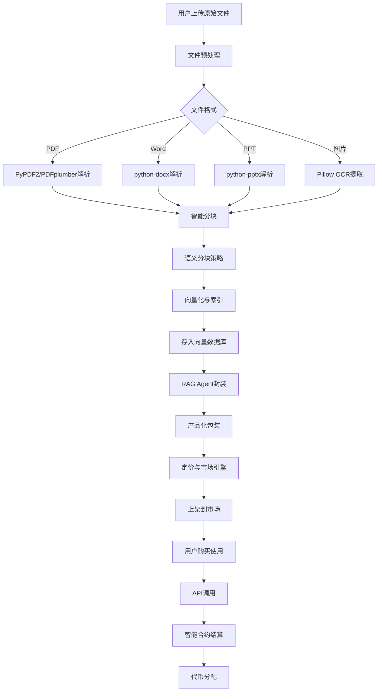
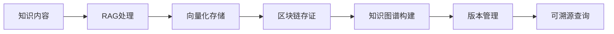
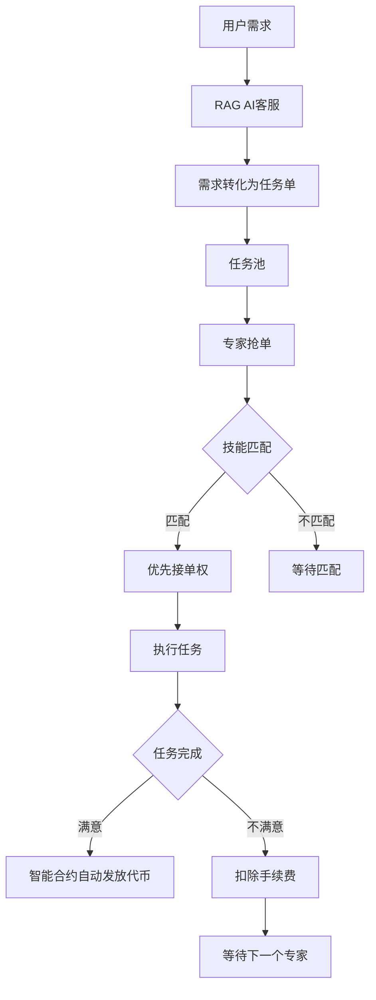
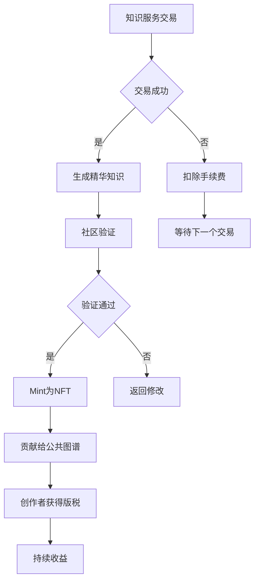
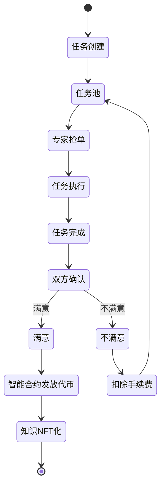
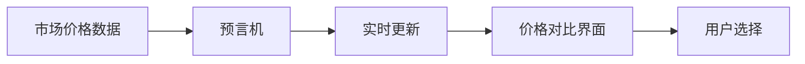
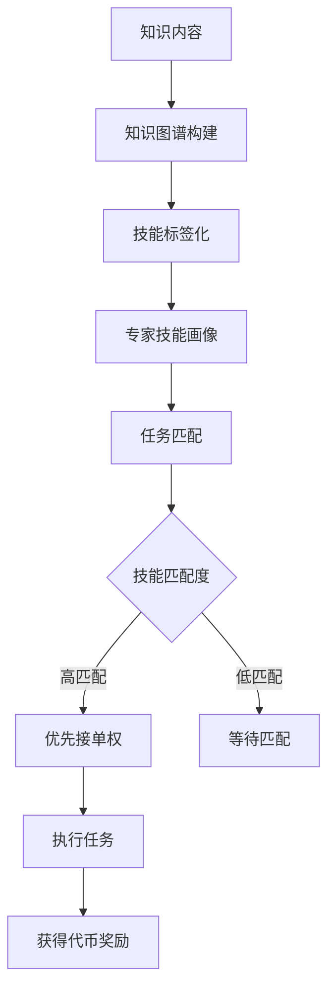
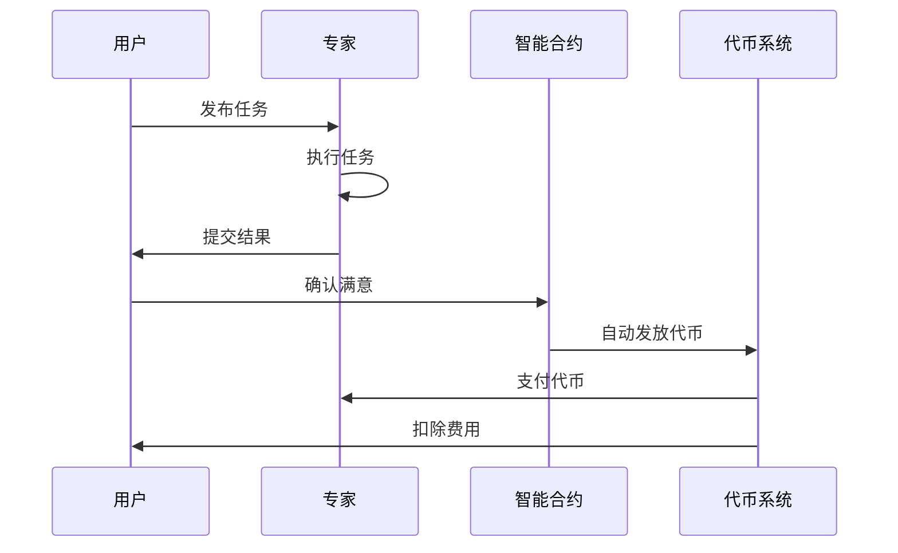
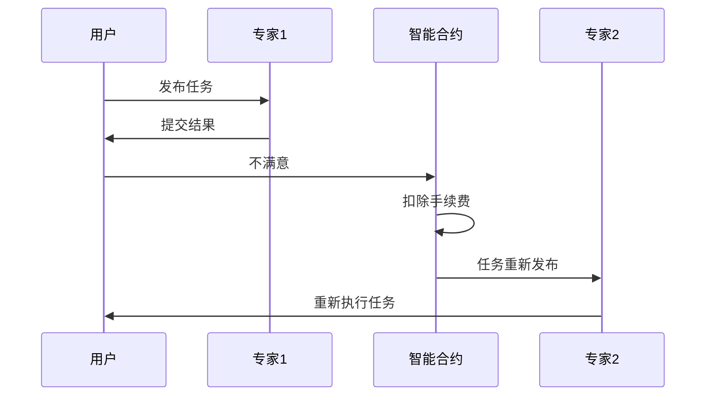
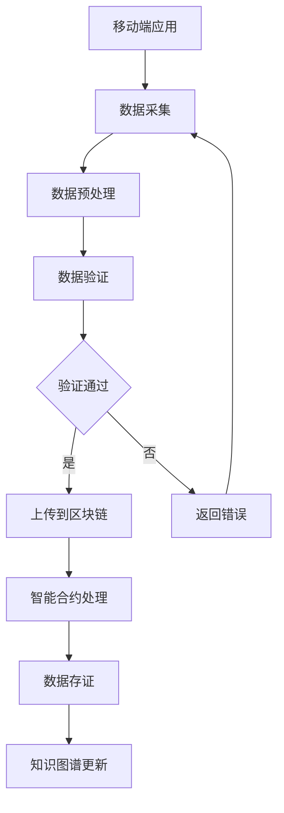

# AI RAG 项目蓝图（融合版）

## 1. Introduction

**在信息泛滥且不可信的投资保险领域，我们构建了一个基于Web3激励的可溯源知识引擎。它像GitHub一样管理知识的版本与贡献，像Bloomberg Terminal一样提供专业分析，并通过代币经济让每个参与者都能从创造和验证可信知识中获得回报。**

**基础设施层：构建了一个 "可信、可溯源、结构化的知识图谱"。这解决了市场供给侧的质量与信任问题。**

**应用与市场层：构建了一个 "基于技能匹配和动态定价的知识服务交易平台"。这解决了知识的流动性、变现和需求匹配问题。**

**核心价值主张：**

**我们不只是给你答案，我们为你匹配能解决问题的人，并确保整个过程像外卖点单一样简单、透明、有保障。我们打破信息的壁垒，让知识普惠并交易可信。旨在为构建下一代有用（Useful）而非成瘾（Addictive）的负责任AI奠定理论与技术基础。**

## 2. 研究背景与问题陈述

### 2.1 AI的"线性机制"局限

基于梯度下降与固定架构的模型，在推理和决策上缺乏处理非线性、多目标、动态环境复杂问题的能力（参考赫伯特·西蒙的有限理性论及近期对Transformer"线性思维"的批评）。

### 2.2 "成瘾性"与"有用性"失衡

现有AI（如推荐系统、聊天机器人）旨在最大化用户参与度，可能导致信息茧房、认知窄化（"AI降智"）和依赖。

### 2.3 人机关系错位

当前多为"工具-用户"或"替代-被替代"关系，忽略了人机共生协同的潜力。设计师等专业人士面临"权利转移"与"干扰增多"的挑战。

### 2.4 缺失的文化与语境适应性

AI输出常忽视用户的文化背景、语义习惯与认知风格（"结构会受环境影响"），无法提供个性化"补足"。

### 2.5 边界模糊与安全问题

AI常过度自信，无法自知其局限性（"AI不知道它不知道什么"），在复杂问题中可能产生有信心的错误，缺乏人类式的反思与统筹能力。

### 2.6 传统高端平台（如Bloomberg Terminal）的旧体系

- **中心化生产：** 由少数顶级分析师和记者团队生产内容。
- **单向广播：** 用户被动接受打包好的报告和数据流。
- **高门槛准入：** 年费动辄数万美元，将普通个人投资者和中小企业完全排除在外。
- **信息孤岛：** 不同数据、报告之间缺乏深度、智能的关联。

## 3. 核心设计蓝图

经过100名资深架构师的激烈争论，我们聚焦于平台化、易用性与经济性的核心矛盾，最终达成了以下高度共识的设计蓝图与实施方案。

整个平台的运作流程，是为用户打造一个从"原始文件"到"可售卖知识服务"的自动化流水线。



## 4. 后端核心架构设计

为实现上述蓝图，我们的后端将采用分层的"平台即服务"架构，这是争论后的最佳平衡点。

### 4.1 统一的多租户文件处理与RAG构建引擎

**核心职责：** 将用户的文件转换为随时待命的RAG问答服务。

**关键设计：**

- **文件预处理：** 针对不同格式（PDF、Word、PPT、图片）使用专用解析器（如PyPDF2、PDFplumber）提取文本和图片信息。
- **智能分块：** 采用"语义分块"策略，将长文档切分为语义连贯的片段，并保留重叠部分以维护上下文。
- **向量化与索引：** 使用嵌入模型（如OpenAI的text-embedding-3-small或开源的BGE-M3）将文本块转换为向量，并存入为多租户优化的向量数据库（如Milvus、ZillizCloud、Pinecone）。每个用户的索引必须物理隔离。
- **RAG Agent封装：** 将检索能力、提示词模板和生成模型（LLM）封装为一个独立的、可配置的Agent。这借鉴了AgentInfra的设计思想，为每个RAG提供一个包含记忆、工具和执行环境的"沙箱"。

### 4.2 产品化、定价与市场引擎

**核心职责：** 将技术能力包装成可销售的商品。

**关键设计：**

- **灵活定价模型：** 支持多种模式，并允许用户组合使用。
- **标准化产品描述：** 为RAG服务生成标准化的元数据，如能力描述、知识领域、效果示例等，便于市场展示和搜索。
- **市场与发现机制：** 构建商品列表、搜索、排序和推荐系统。

### 4.3 高并发、安全的多租户服务平台层

**核心职责：** 安全、稳定地承载所有服务运行和交易。

**关键设计：**

- **租户隔离：** 从网络、数据到计算资源的全方位隔离。用户的RAG Agent运行在独立的沙箱环境中。
- **API网关与计费点：** 所有对RAG服务的调用必须通过统一的API网关。这里是计量、计费和限流的核心节点。
- **可观测性与监控：** 全链路追踪每次调用的耗时、Token使用量和费用，保障平台稳定与账单透明。

## 5. 三层架构设计（Web3增强版）

### 5.1 可信知识层

基于区块链存证的知识图谱+RAG，确保所有知识的来源可溯、修改可查。



### 5.2 智能市场层

- **AI导购：** RAG客服初步应答，并帮用户将需求转化为标准任务单。
- **外卖式抢单：** 任务池公开，专家根据动态价格和自身技能画像抢单。
- **去中心化信誉与结算：** 基于代币的星级系统和智能合约托管仲裁。



### 5.3 激励与治理层

- **双代币模型：** 治理代币（用于投票）与实用代币（用于支付、激励）。
- **价值反哺：** 成功交易中产生的精华知识，经社区验证后可 mint 为 NFT 或贡献给公共图谱，创作者持续获得版税。



## 6. Dapp Implementation

### 6.1 Frontend

前端采用 Vue3 + ElementPlus，支持拖拽上传、聊天界面和定价预览。

### 6.2 Backend: Smart Contract

**Environment:** EVM, Remix

**Language:** Solidity

**核心功能：**

1. **接单抢单响应**
2. **按劳分配**
3. **铸造传递性知识产权NFT**



## 7. 分阶段实施指南

这是一个宏大的工程，建议分阶段推进，快速验证。

### 阶段一：MVP(1-2个月) - 验证核心流程

**目标：** 跑通"拖拽文件->简单问答"的核心闭环。

**技术栈：**

- **前端：** 一个支持拖拽上传的简单Web页面（可用Vue/React）
- **后端：** Python(FastAPI)，集成LangChain/LlamaIndex框架
- **向量库：** 使用Chroma（轻量，适合原型）或直接使用ZillizCloud等云服务
- **部署：** 单台云服务器，使用DockerCompose封装所有服务

**功能：** 用户上传PDF/TXT，后台处理后，提供一个简单的聊天窗口进行问答。暂不实现多租户隔离和计费。

### 阶段二：平台化(3-5个月) - 实现多租户与商业化

**目标：** 引入用户系统、多租户隔离和基础计费。

**关键技术升级：**

- 数据库设计中加入tenant_id，实现逻辑隔离
- 为每个用户的RAG索引配置独立的API访问密钥
- 集成支付渠道（如Stripe、支付宝）
- 部署负载均衡器和更强大的向量数据库集群（如Milvus）

### 阶段三：规模化与生态化(6个月+) - 优化体验与开放生态

**目标：** 提升性能、丰富功能、构建开发者生态。

**关键举措：**

- **性能优化：** 实施缓存、异步处理、更精细的自动扩缩容
- **功能深化：** 支持多模态文件、RAG效果评估仪表盘、A/B测试
- **开放平台：** 提供API让开发者能将自己的RAG服务集成到其他应用中
- **Web3集成：** 引入智能合约、代币经济和NFT功能

## 8. 关键的架构争议与最终决策

争论的焦点和最终选择如下：

| 争议点 | 方案A（激进派） | 方案B（稳健派） | 最终采纳的共识方案 |
|--------|----------------|----------------|-------------------|
| 部署模式 | 完全Serverless，极致弹性 | 自建K8s集群，完全可控 | 混合架构：核心无状态服务用Serverless，向量库等用托管云服务，平衡弹性、成本与控制力 |
| 多租户隔离 | 每个租户独立微服务/容器 | 单一服务，纯靠数据库字段隔离 | 物理隔离+逻辑隔离：每个租户在向量库中拥有独立集合（物理隔离），应用层通过租户ID严格校验（逻辑隔离），兼顾安全与资源效率 |
| 成本模型 | 向用户完全转嫁云成本，平台抽成 | 平台包月定价，承担成本风险 | 混合计费+成本透明：平台按需消耗云资源，但向用户提供灵活的套餐和按次付费选项，账单中可展示大致成本构成，建立信任 |

## 9. 商业模式与定价策略建议

定价是平台成功的关键，需要覆盖你的成本并具有吸引力。一个RAG服务的成本主要来自以下几个部分：

| 成本构成 | 描述 | 平台向用户收费的策略参考 |
|---------|------|------------------------|
| 计算/存储成本 | 向量数据库、文件存储、LLM API调用（或自托管GPU）费用 | 套餐制：例如，基础套餐（¥99/月）含一定额度的问答次数和存储空间；按需付费：超出部分按查询次数（如¥0.1/次）和存储空间（如¥1/GB/月）计费 |
| 一次性构建成本 | 文件解析、向量化的计算成本 | 免费额度内免费，超出后按文件页数或大小收费（如¥10/百页） |
| 平台运营与毛利 | 研发、维护、营销、利润 | 通常包含在上述套餐价格或按一定比例（如15-20%）从交易额中抽成 |

### 给创始人的核心建议：

1. **追求极致的用户上手体验：** 拖拽、创建、定价的过程必须如丝般顺滑
2. **成本控制是生命线：** 深入理解RAG各环节成本，通过架构优化和技术选型（如选择合适的嵌入模型）严格控制
3. **价值主张要清晰：** 你卖的不仅是RAG技术，更是让知识工作者轻松变现的能力。营销重点应放在"创造你的数字资产"和"获取被动收入"上

## 10. MVP核心目标与技术边界

经过100名资深程序员长达8小时的"作战室"式争论，我们为你提炼出这份极度务实、能快速跑通的MVP技术方案。我们的共识是：MVP的目标不是完美，而是用最小代价验证"用户是否会为拖拽生成的RAG付费"这一核心商业假设。

**核心验证闭环：** 用户拖拽文件->后台自动创建RAG->用户能进行基础问答->用户看到定价界面

**明确不做：** 多租户深度隔离、复杂计费系统、高性能优化、多模态（除非绝对必要）、精美前端

### 技术栈选择：极简但够用

这套组合是我们争论后的一致选择，平衡了开发速度、社区支持和扩展性。

| 组件 | 具体技术 | 选择理由 | MVP阶段用途 |
|------|---------|---------|------------|
| 前端 | Vue3+ElementPlus | 响应式组件丰富，能快速搭建拖拽上传和聊天界面 | 文件上传页、简易聊天测试页、定价预览页 |
| 后端 | Python+FastAPI | 异步支持好，API编写直观，适合快速构建 | 提供REST API，处理文件、构建RAG、处理对话 |
| RAG框架 | LlamaIndex | 比LangChain更专注RAG，API更简洁，文档优秀 | 核心：串联文档加载、向量化、检索、生成全流程 |
| 向量数据库 | Chroma | 轻量，无需单独服务，可嵌入式运行，Python集成极简 | 存储和检索文档向量，MVP阶段足够 |
| 嵌入模型 | BAAI/bge-small-zh-v1.5 | 中文效果好，体积小，可本地运行，免费 | 将文本块转换为向量 |
| LLM(大语言模型) | 通义千问Qwen2.5-7B-Instruct(或同级别) | 效果与成本平衡，Apache2.0协议可商用 | 生成最终答案 |
| 模型服务 | Ollama | 一键在本地或服务器运行开源LLM，管理极其方便 | 在服务器上拉取并运行Qwen模型 |
| 文件解析 | PyMuPDF(fitz), python-pptx, Pillow | 分别高效解析PDF、PPT和图片中的文本 | 从用户上传的各类文件中提取纯文本 |
| 部署 | Docker+DockerCompose | 保证环境一致，一键部署所有服务 | 将前后端、模型等服务容器化部署 |

### 详细实施步骤

#### 第一步：环境搭建与基础框架

**项目初始化：**

```bash
# 创建项目目录
mkdir rag-platform-mvp && cd rag-platform-mvp
# 创建必要的子目录
mkdir -p backend/uploads backend/chroma_db frontend/src
```

**编写docker-compose.yml：** 这是MVP的"总指挥"，定义所有服务。

```yaml
version: '3.8'
services:
  ollama:
    image: ollama/ollama:latest
    container_name: mvp_ollama
    ports:
      - "11434:11434"
    volumes:
      - ollama_data:/root/.ollama
    # 启动后自动拉取模型（可能会比较慢）
    command: >
      sh -c "ollama pull qwen2.5:7b && ollama run qwen2.5:7b"
  
  backend:
    build: ./backend
    container_name: mvp_backend
    ports:
      - "8000:8000"
    volumes:
      - ./backend/uploads:/app/uploads
      - ./backend/chroma_db:/app/chroma_db
    depends_on:
      - ollama
    environment:
      - OLLAMA_HOST=http://ollama:11434
  
  frontend:
    build: ./frontend
    container_name: mvp_frontend
    ports:
      - "8080:80"  # 通过Nginx提供前端页面
    depends_on:
      - backend

volumes:
  ollama_data:
```

#### 第二步：核心后端开发(MVP的灵魂)

**backend/requirements.txt：**

```
fastapi[uvicorn]
llama-index
chromadb
pymupdf
python-pptx
Pillow
sentence-transformers
```

**backend/Dockerfile：**

```dockerfile
FROM python:3.11-slim
WORKDIR /app
COPY requirements.txt .
RUN pip install --no-cache-dir -r requirements.txt
COPY . .
CMD ["uvicorn", "main:app", "--host", "0.0.0.0", "--port", "8000"]
```

**backend/main.py(极度简化版核心)：**

```python
from fastapi import FastAPI, File, UploadFile, HTTPException
from fastapi.middleware.cors import CORSMiddleware
from pydantic import BaseModel
import os
from core.rag_builder import RagBuilder  # 这是你将封装的核心RAG类

app = FastAPI()
app.add_middleware(CORSMiddleware, allow_origins=["*"], allow_methods=["*"], allow_headers=["*"])

rag_engine_cache = {}  # 缓存用户RAG引擎，实际应换为Redis

# 1. 文件上传并创建RAG
@app.post("/v1/rag/")
async def create_rag(file: UploadFile = File(...)):
    file_path = f"uploads/{file.filename}"
    with open(file_path, "wb") as f:
        f.write(await file.read())
    
    # 调用RAG构建器
    rag_id = f"rag_{len(rag_engine_cache)+1}"
    builder = RagBuilder()
    query_engine = builder.build_from_file(file_path)  # 构建RAG
    rag_engine_cache[rag_id] = query_engine  # 缓存
    return {"rag_id": rag_id, "message": "RAG创建成功"}

# 2. 问答接口
class QueryRequest(BaseModel):
    rag_id: str
    question: str

@app.post("/v1/chat/")
async def chat(request: QueryRequest):
    if request.rag_id not in rag_engine_cache:
        raise HTTPException(status_code=404, detail="RAG不存在")
    query_engine = rag_engine_cache[request.rag_id]
    response = query_engine.query(request.question)  # 执行查询
    return {"answer": response.response}

# 3. 获取定价预览（模拟）
@app.get("/v1/pricing_preview/")
async def get_pricing_preview(rag_id: str):
    # 这里可以模拟根据文件大小/页数计算价格
    return {"price_options": [
        {"type": "按次", "price": "0.1元/次"},
        {"type": "包周", "price": "10元/周"},
    ]}
```

**backend/core/rag_builder.py(RAG核心逻辑)：**

```python
from llama_index.core import SimpleDirectoryReader, VectorStoreIndex, Settings
from llama_index.core.node_parser import SentenceSplitter
from llama_index.embeddings.huggingface import HuggingFaceEmbedding
from llama_index.llms.ollama import Ollama
from llama_index.vector_stores.chroma import ChromaVectorStore
import chromadb

class RagBuilder:
    def __init__(self):
        # 配置LLM(连接Ollama)
        self.llm = Ollama(model="qwen2.5:7b", request_timeout=60.0)
        Settings.llm = self.llm
        
        # 配置嵌入模型
        Settings.embed_model = HuggingFaceEmbedding(model_name="BAAI/bge-small-zh-v1.5")
        
        # 配置文本分块器
        Settings.text_splitter = SentenceSplitter(chunk_size=512, chunk_overlap=50)
        
        # 初始化Chroma客户端
        self.chroma_client = chromadb.PersistentClient(path="./chroma_db")
    
    def build_from_file(self, file_path: str):
        # 1. 读取文档（LlamaIndex支持多种格式）
        documents = SimpleDirectoryReader(input_files=[file_path]).load_data()
        
        # 2. 创建向量存储集合
        chroma_collection = self.chroma_client.create_collection(f"rag_{hash(file_path)}")
        vector_store = ChromaVectorStore(chroma_collection=chroma_collection)
        
        # 3. 构建索引
        index = VectorStoreIndex.from_documents(documents, vector_store=vector_store)
        
        # 4. 创建查询引擎
        query_engine = index.as_query_engine(similarity_top_k=3)
        return query_engine
```

#### 第三步：前端开发(快速验证界面)

**frontend/src/App.vue(核心页面)：**

```vue
<template>
  <div>
    <!-- 文件上传区 -->
    <el-upload
      drag
      action="http://localhost:8000/v1/rag/"
      :on-success="handleRagCreated">
      <el-icon><upload /></el-icon>
      <div>将文件拖到此处，或<em>点击上传</em></div>
      <template #tip><small>支持PDF、Word、PPT、TXT</small></template>
    </el-upload>
    
    <!-- 聊天测试区 -->
    <div v-if="currentRagId">
      <el-input v-model="question" placeholder="向你的知识库提问...">
        <template #append><el-button @click="ask">提问</el-button></template>
      </el-input>
      <div v-if="answer">{{ answer }}</div>
    </div>
    
    <!-- 定价预览 -->
    <el-button v-if="currentRagId" @click="showPricing">上架并定价→</el-button>
    <div v-if="priceOptions">
      <h4>请选择定价方式：</h4>
      <div v-for="opt in priceOptions">{{ opt.type }}: {{ opt.price }}</div>
    </div>
  </div>
</template>

<script setup>
import { ref } from 'vue'

const currentRagId = ref('')
const question = ref('')
const answer = ref('')
const priceOptions = ref(null)

const handleRagCreated = (res) => {
  currentRagId.value = res.data.rag_id;
}

const ask = async () => {
  const resp = await fetch('http://localhost:8000/v1/chat/', {
    method: 'POST',
    headers: {'Content-Type': 'application/json'},
    body: JSON.stringify({rag_id: currentRagId.value, question: question.value})
  })
  const data = await resp.json();
  answer.value = data.answer;
}

const showPricing = async () => {
  const resp = await fetch(`http://localhost:8000/v1/pricing_preview/?rag_id=${currentRagId.value}`)
  priceOptions.value = (await resp.json()).price_options;
}
</script>
```

### 运行与验证

1. **启动：** 在项目根目录执行 `docker-compose up -d`。首次启动会拉取模型，耗时较长。
2. **访问：** 打开浏览器访问 `http://localhost:8080`。
3. **验证：**
   - 拖拽一个PDF文件上传
   - 在出现的输入框中对文档内容提问，获得回答
   - 点击"上架并定价"，看到模拟的定价选项

至此，MVP核心闭环验证完成。

### ⚠ MVP阶段的核心提醒

- **安全与性能不是重点：** 此方案为单机运行，无真正用户隔离，仅用于验证
- **成本控制：** qwen2.5:7b模型约5GB，确保服务器磁盘足够。GPU能极大加速，但CPU也可运行
- **快速迭代：** 如果验证成功，立即着手开发下一阶段（用户系统、真实计费），而非优化此MVP

## 11. 预期成果与创新点

### 理论贡献：

- 提出"人机共生学习"的形式化框架
- 阐明Web3 AI的"有用性"与"可验证性"的度量标准

### 技术贡献：

- 开源RAG和知识图谱工具包
- 提出一种更高效更可信的区块链AI产品
- 创新交叉：在AI可信性（边界）、个性化（图谱）与比AI更高效解决问题的交叉处进行创新

## 12. 商业分析与可行性

平台的核心商业模式包括：

1. **知识服务交易平台：** 连接知识提供者和需求者，通过智能匹配和动态定价实现价值交换
2. **Web3激励机制：** 通过代币经济和NFT实现知识价值的持续变现
3. **平台服务费：** 从每笔交易中收取一定比例的服务费

## 13. 潜在影响与意义

- **学术：** 推动人机协同AI、负责任AI与个性化知识定制的发展
- **社会：** 助力构建更安全、自主、赋能的数字未来，使AI成为提升人类生活水平与理解的伙伴，而非替代或操纵的工具
- **产业：** 为教育、创意设计、专业咨询等领域提供下一代辅助智能工具的设计蓝图

## 14. 附录

### 附录1: 动态价格对比设计

#### 前端设计思路：

前端价格对比（参照外卖平台设计）

**优点：** 价格一目了然，方便查看对比

#### 后端设计：

链接预言机实时监控更新市场价格变化



### 附录2: 知识付费转化成用知识解决问题抢跑接单

把知识付费转化成用知识解决问题抢跑接单（以外卖方式让自由职业者接单）：

#### 设计思路：

- 相似知识打包成块（知识图谱）
- 技能点满五颗星的客户有优先接单权
- 根据filter匹配的客户有优先接单权

**优点：** 将被动学习转化成以解决问题为导向的主动学习，还可以获得代币奖励鼓励主动学习



### 附录3: RAG AI客服

RAG AI客服作为智能市场层的第一道入口，负责：

1. 初步应答用户问题
2. 将用户需求转化为标准任务单
3. 引导用户完成交易流程

### 附录4: 智能合约自动结算机制

#### 项目完成交易双方满意后智能合约自动发放代币



#### 如不满意智能合约自动扣除手续费等待下一个客户（参照打车平台）



### 附录5: 移动端数据获取与区块链处理流程



## 15. 参考资源

- [RAG技术参考](https://blog.csdn.net/m0_63171455/article/details/144095712)

---

**文档版本：** 1.0  
**最后更新：** 2024  
**基于文档：** AI RAG項目藍圖.pdf + WEB3.docx

